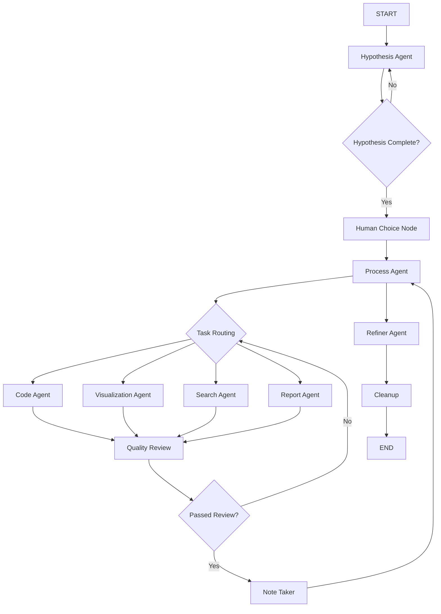

# Samba Co-Pilot Codebase Documentation


## Table of Contents

1. [Architecture Overview](#architecture-overview)
2. [Data Science Agent Deep Dive](#data-science-agent-deep-dive)
3. [WebSocket Integration & Subgraph System](#websocket-integration--subgraph-system)
4. [Frontend Component Architecture](#frontend-component-architecture)
5. [Code Execution Flow with Daytona](#code-execution-flow-with-daytona)
6. [PersistentDaytonaManager - Advanced Code Execution](#persistentdaytonamanager---advanced-code-execution)
7. [Deep Research System](#deep-research-system)
8. [Code Execution Subgraph with Error Handling](#code-execution-subgraph-with-error-handling)
9. [Comprehensive File Management System](#comprehensive-file-management-system)
10. [Human Choice Node and Feedback Classification](#human-choice-node-and-feedback-classification)
11. [State Management Patterns](#state-management-patterns)
12. [Recent Fixes & Improvements](#recent-fixes--improvements)
13. [Development Guide](#development-guide)

---

## Architecture Overview

### Core Structure

The Samba Co-Pilot application is a **full-stack AI agent platform** with the following key components:

```
samba-co-pilot/
├── backend/                    # FastAPI backend with agent orchestration
│   └── src/agents/
│       ├── api/                # WebSocket API & connection management
│       ├── components/         # Agent implementations
│       │   ├── compound/       # Multi-agent subgraphs (data_science, financial, etc.)
│       │   ├── datagen/        # Data science agent workflow
│       │   └── open_deep_research/ # Research agent workflow
│       ├── tools/              # Agent tools and integrations
│       └── storage/            # Redis storage & vector stores
└── frontend/                   # Vue.js frontend
    └── sales-agent-crew/src/
        ├── components/         # UI components
        └── utils/              # Frontend utilities
```

### Key Technologies
- **Backend:** FastAPI, LangGraph, SambaNova LLMs, Redis, Daytona SDK
- **Frontend:** Vue.js 3, Tailwind CSS, WebSocket connections
- **Agent Framework:** LangGraph with custom multi-agent workflows
- **Code Execution:** Daytona sandboxes for secure Python execution
- **Storage:** Redis for session/message storage, vector storage for retrieval

---

## Data Science Agent Deep Dive

### Overview

The **Data Science Agent** is a sophisticated multi-agent system implemented in the last 4 weeks. It provides end-to-end data science workflows including hypothesis generation, data analysis, code execution, visualization, and reporting.

### Agent Architecture

The data science subgraph consists of **8 specialized agents**:

1. **Hypothesis Agent** - Formulates research hypotheses
2. **Process Agent** - Supervises workflow and task delegation  
3. **Visualization Agent** - Creates data visualizations
4. **Search Agent** - Performs web research
5. **Code Agent** - Writes and executes Python code
6. **Report Agent** - Generates final reports
7. **Quality Review Agent** - Reviews and validates work
8. **Note Agent** - Summarizes and tracks progress

### Implementation Files

#### Core Subgraph
- **`backend/src/agents/components/compound/data_science_subgraph.py`**
  - Entry point for data science workflow
  - Sets up language models for each agent
  - Creates WorkflowManager instance

#### Workflow Management
- **`backend/src/agents/components/datagen/workflow.py`**
  - Orchestrates the entire agent workflow
  - Defines the LangGraph state machine
  - Manages agent routing and transitions

#### State Management
- **`backend/src/agents/components/datagen/state.py`**
  - Defines the shared state structure
  - Custom reducers for message handling
  - State fields for each agent's work

#### Individual Agents
Located in `backend/src/agents/components/datagen/agent/`:
- `hypothesis_agent.py` - Research hypothesis generation
- `code_agent.py` - Python code generation and execution
- `process_agent.py` - Workflow supervision and task routing
- `visualization_agent.py` - Data visualization creation
- `search_agent.py` - Web search and research
- `report_agent.py` - Final report generation
- `quality_review_agent.py` - Work validation
- `note_agent.py` - Progress summarization

### Key State Structure

```python
class State(TypedDict):
    # Message sequences
    internal_messages: Annotated[Sequence[AnyMessage], add_messages]
    messages: Annotated[Sequence[AnyMessage], replace_messages]
    
    # Agent-specific states
    hypothesis: str
    process_decision: str
    task: str
    visualization_state: str
    searcher_state: str
    code_state: str
    report_state: str
    quality_review: str
    
    # Control fields
    sender: str
    modification_areas: str
    agent_quality_review_retries: int
```

### Workflow Flow



### Agent Creation Pattern

Each agent follows a consistent creation pattern:

```python
def create_agent(
    llm: LanguageModelLike,
    tools: list,
    system_message: str,
    team_members: list[str],
    directory_content: list[str],
    name: str,
) -> ManualAgent:
```

**Key Features:**
- **ManualAgent wrapper** - Custom agent class for tool handling
- **Persistent Daytona integration** - Shared sandbox across agents
- **Directory content awareness** - Agents know about uploaded files
- **Team member awareness** - Agents understand their role in the team

### Tool Integration

Each agent has access to:
- **Core tools**: Wikipedia, Tavily search, ArXiv
- **Daytona tools**: Code execution, file operations, data analysis
- **Custom tools**: Agent-specific capabilities

Example from Code Agent:
```python
tools = [
    get_daytona_execute_code(daytona_manager),
    get_daytona_pip_install(daytona_manager),
    get_daytona_list_files(daytona_manager),
    get_daytona_describe_data(daytona_manager),
]
```

---

## WebSocket Integration & Subgraph System

### WebSocket Manager

**File:** `backend/src/agents/api/websocket_manager.py`

The WebSocketConnectionManager is the central orchestrator that:
1. **Manages connections** per user/conversation
2. **Routes messages** to appropriate subgraphs
3. **Handles subgraph selection** based on content/context
4. **Manages persistent Daytona instances**

### Subgraph Selection Logic

The data science subgraph is triggered when:

```python
enable_data_science = False
if data_analysis_doc_ids:  # CSV files detected
    enable_data_science = True
```

### Subgraph Configuration

When data science is enabled, the WebSocket manager adds:

```python
config["configurable"]["type==default/subgraphs"]["data_science"] = {
    "description": "This subgraph performs comprehensive end-to-end data science workflows...",
    "next_node": END,
    "graph": create_data_science_subgraph(
        user_id=user_id,
        sambanova_api_key=api_keys.sambanova_key,
        redis_storage=self.message_storage,
        daytona_manager=daytona_manager,
        directory_content=directory_content,
    ),
    "state_input_mapper": lambda x: {...},
    "state_output_mapper": lambda x: {...}
}
```

### Available Subgraphs

1. **data_science** - Multi-agent data science workflow
2. **financial_analysis** - Financial data analysis
3. **deep_research** - Comprehensive research reports
4. **DaytonaCodeSandbox** - Simple code execution

### System Message Integration

The WebSocket manager dynamically builds system messages:

```python
config["configurable"]["type==default/system_message"] = f"""
You are a helpful assistant. Today's date is {datetime.now().strftime('%Y-%m-%d')}. 
{retrieval_prompt} 
{data_analysis_prompt}
CRITICAL: For file creation, NEVER show code in response text - write ALL code inside DaytonaCodeSandbox subgraph.
"""
```

---

## Frontend Component Architecture

### Component Structure

The frontend uses a **component-based architecture** with specialized components for different agent types:

**Key Files:**
- `frontend/sales-agent-crew/src/utils/componentUtils.js`
- `frontend/sales-agent-crew/src/utils/globalFunctions.js`
- `frontend/sales-agent-crew/src/components/ChatMain/ResponseTypes/`

### Agent Type Mapping

The frontend maps agent types to components:

```javascript
export function getComponentByAgentType(agentType) {
  switch (agentType) {
    case 'data_science_end':
      return AssistantEndComponentWithCharts
    case 'deep_research_end':
      return DeepResearchComponent
    case 'financial_analysis_end':
      return FinancialAnalysisEndComponent
    // ... more mappings
  }
}
```

### Data Science Frontend Handling

**Key Components:**
1. **AssistantEndComponentWithCharts.vue** - Handles final data science results
2. **ChatBubble.vue** - Processes streaming data science messages
3. **TimelineItem.vue** - Shows agent progression

### Message Processing

Data science agents send messages with:
```javascript
{
  "agent_type": "data_science_hypothesis_agent",
  "content": "...",
  "additional_kwargs": {
    "timestamp": "...",
    "files": [...]
  }
}
```

### Chart Handling

The `AssistantEndComponentWithCharts` component:
- **Parses chart placeholders** in markdown
- **Fetches chart images** via API
- **Displays in modal** for full-screen viewing
- **Handles authentication** for shared conversations

---

## Code Execution Flow with Daytona

### Persistent Daytona Manager

**File:** `backend/src/agents/components/datagen/tools/persistent_daytona.py`

The PersistentDaytonaManager provides:
- **Persistent sandboxes** across the entire workflow
- **File upload/download** capabilities
- **Code execution** with result capture
- **Package installation** support

### Key Features

```python
class PersistentDaytonaManager:
    def __init__(self, user_id, redis_storage, snapshot="data-analysis:0.0.10", file_ids=None):
        # Creates sandbox on first use
        # Uploads user files to sandbox
        # Maintains session throughout workflow
```

### Available Daytona Tools

1. **get_daytona_execute_code()** - Execute Python code
2. **get_daytona_pip_install()** - Install packages
3. **get_daytona_list_files()** - List sandbox files
4. **get_daytona_describe_data()** - Analyze CSV files

### Execution Flow

1. **First agent call** → Creates Daytona sandbox
2. **File uploads** → User files copied to sandbox
3. **Code execution** → Agents execute code in persistent environment
4. **Result sharing** → Files/outputs shared between agents
5. **Cleanup** → Sandbox cleaned up at workflow end

### Error Handling

Recent improvements include:
- **Execution status tracking** - Returns (success, result) tuples
- **Result truncation** - Shows beginning and end of long outputs
- **Better error reporting** - Structured error messages

---

## State Management Patterns

### Message Flow Architecture

The system uses a **dual-message system**:

1. **internal_messages** - Full conversation history for agents
2. **messages** - Frontend-specific messages for UI

### Custom Reducers

```python
def add_messages(left, right):
    """Appends messages to conversation history"""
    
def replace_messages(left, right):
    """Replaces frontend messages entirely"""
    
def dynamic_reducer(left, right):
    """Accumulates state with spaces"""
```

### Agent Communication

Agents communicate through:
- **Shared state updates** - Each agent updates relevant state fields
- **Message passing** - AIMessage objects with metadata
- **Tool results** - Structured outputs from tool calls

### Frontend State Sync

The frontend receives:
- **Real-time updates** via WebSocket
- **Agent type metadata** for component routing
- **File references** for download/display
- **Progress indicators** for multi-step workflows

---

## PersistentDaytonaManager - Advanced Code Execution

### Overview
The `PersistentDaytonaManager` is a sophisticated sandbox management system that maintains persistent Daytona client and sandbox instances throughout the workflow lifecycle. It's crucial for the data science agents' code execution capabilities.

### Key Features
- **Persistent Sandbox**: Maintains state between code executions, preserving variables and files
- **File Management**: Upload files from Redis to sandbox, read/write operations
- **Code Execution**: Execute Python code with proper error handling and output truncation
- **Document Management**: Create, edit, and manipulate documents in Markdown format
- **Data Analysis**: Specialized tools for CSV data analysis with multiple encoding support
- **Package Management**: Dynamic pip package installation during execution

### Implementation Details

#### Initialization and File Upload
```python
# From: backend/src/agents/components/datagen/tools/persistent_daytona.py
class PersistentDaytonaManager:
    def __init__(
        self,
        user_id: str,
        redis_storage: RedisStorage,
        snapshot: str = "data-analysis:0.0.10",
        file_ids: Optional[List[str]] = None,
    ):
        """
        Initialize the persistent Daytona manager.
        - Creates sandbox from snapshot on first use
        - Uploads specified files from Redis to sandbox root
        - Maintains persistent client throughout session
        """
```

#### Core Tool Functions
The manager provides several specialized tools through factory functions:

1. **Code Execution**: `get_daytona_execute_code(manager)`
2. **File Operations**: `get_daytona_list_files()`, `get_daytona_read_file()`, `get_daytona_write_file()`
3. **Document Management**: `get_daytona_create_document()`, `get_daytona_edit_document()`
4. **Data Analysis**: `get_daytona_describe_data()` - specialized CSV analysis
5. **Package Management**: `get_daytona_pip_install()` - dynamic package installation

#### Advanced Output Handling
```python
# Output truncation for long results
MAX_RESULT_LENGTH = 1000
if len(result_str) > MAX_RESULT_LENGTH:
    first_part_length = MAX_RESULT_LENGTH // 2
    last_part_length = MAX_RESULT_LENGTH - first_part_length
    first_part = result_str[:first_part_length]
    last_part = result_str[-last_part_length:]
    result_str = f"{first_part}\n\n{last_part}\n\n[OUTPUT TRUNCATED - Original length: {len(result_str)} characters]"
```

### Integration with Data Science Agents
The PersistentDaytonaManager is created per user session and shared across all data science agents:

```python
# From: backend/src/agents/api/websocket_manager.py
daytona_manager = PersistentDaytonaManager(
    user_id=user_id,
    redis_storage=self.message_storage,
    snapshot="data-analysis:0.0.10",
    file_ids=data_analysis_doc_ids,  # CSV files uploaded by user
)
self.daytona_managers[f"{user_id}:{thread_id}"] = daytona_manager
```

---

## Deep Research System

### Overview
The Deep Research System is a comprehensive research workflow that generates detailed reports with multiple perspectives, sources, and analysis. It's implemented as a LangGraph workflow with multiple specialized nodes.

### Architecture Components

#### Core State Management
```python
# From: backend/src/agents/components/open_deep_research/state.py
class ReportState(TypedDict):
    topic: str  # Research topic
    sections: List[Section]  # Report sections
    completed_sections: Annotated[List[Section], operator.add]
    final_report: str  # Complete formatted report
    feedback_on_report_plan: str  # Human feedback
    document: Optional[str]  # Optional documents to process
    messages: Annotated[List[BaseMessage], operator.add]
    files: Annotated[list[str], operator.add]  # Generated files
```

#### Research Workflow Nodes

1. **Report Planning**: `generate_report_plan()`
   - Generates search queries for planning
   - Creates structured report sections
   - Uses web search to inform section planning

2. **Human Feedback**: `human_feedback()`
   - Interrupts workflow for user approval
   - Allows plan modification before execution
   - Routes to section building or plan regeneration

3. **Section Building**: `build_section_with_web_research`
   - Generates targeted search queries per section
   - Performs web search using Tavily or Perplexity APIs
   - Writes section content based on search results
   - Includes quality grading and revision loops

4. **Final Compilation**: `compile_final_report()`
   - Combines all sections into final report
   - Extracts and formats citations
   - Generates PDF version of report
   - Stores files in Redis for download

#### Search Integration
```python
# From: backend/src/agents/components/open_deep_research/utils.py
class APIKeyRotator:
    def __init__(self, env_var_prefix: str = "TAVILY_API_KEY"):
        """Rotates between multiple API keys for search services"""
        
async def tavily_search_async(search_queries: List[str], key_rotator: APIKeyRotator):
    """Concurrent web searches with automatic fallback to Perplexity"""
```

#### Quality Control System
Each section goes through quality grading:
```python
# Section grader evaluates content and provides feedback
class Feedback(BaseModel):
    grade: Literal["pass", "fail"]
    feedback: str
    follow_up_queries: List[SearchQuery]
```

### WebSocket Integration
```python
# From: backend/src/agents/api/websocket_manager.py
"deep_research": {
    "description": "Generates comprehensive research reports with multiple perspectives...",
    "graph": create_deep_research_graph(
        api_key=api_keys.sambanova_key,
        provider="sambanova",
        request_timeout=120,
        redis_storage=self.message_storage,
        user_id=user_id,
    ),
    "state_input_mapper": lambda x: {"topic": x},
    "state_output_mapper": lambda x: AIMessage(
        content=x["final_report"],
        name="DeepResearch",
        additional_kwargs={
            "agent_type": "deep_research_end",
            "files": x["files"],  # PDF attachments
        },
    ),
}
```

---

## Code Execution Subgraph with Error Handling

### Overview
The Code Execution Subgraph provides intelligent error handling and code correction capabilities with integrated web search for research when needed.

### Error Classification and Handling
```python
# From: backend/src/agents/components/compound/code_execution_subgraph.py
class CodeCorrections(BaseModel):
    corrections: List[CodeReplacement] = Field(
        description="List of code corrections. Empty if research needed.",
        default_factory=list,
    )
    search_query: Optional[str] = Field(
        default=None,
        description="Concise search query if more information needed",
    )
    additional_packages: List[str] = Field(
        description="Packages to install. Empty if research needed.",
        default_factory=list,
    )
```

### Error Processing Workflow

#### 1. Error Analysis
The system categorizes errors into:
- **Category A**: Simple syntax errors, typos, undefined variables
- **Category B**: Complex library API errors (AttributeError, TypeError, ValueError)
- **Category C**: Unrecognized errors

#### 2. Decision Logic
```python
# System prompt excerpt from code_execution_subgraph.py
"""
DECISION LOGIC:
* If `search_context` is EMPTY:
    * Category (a) errors: Propose fix directly
    * Category (b)/(c) errors: Request search, DO NOT GUESS
* If `search_context` is NOT EMPTY:
    * Use search context to formulate definitive fix
"""
```

#### 3. Search Integration
When the system needs more information:
```python
# Example search query generation
search_query = "pandas DataFrame.apply TypeError: 'str' object is not callable"
```

#### 4. Code Correction
Precise code replacement with context:
```python
class CodeReplacement(BaseModel):
    remove: str = Field(description="Exact code to replace")
    add: str = Field(description="New code to add")
```

### Integration with PersistentDaytonaManager
```python
# From recent commits - enhanced error handling
# Includes steps_taken tracking and package installation support
async def correct_code_node(state: CorrectingExecutorState):
    """
    Node that attempts to correct code based on errors and search context
    """
    # Execute corrections using PersistentDaytonaManager
    # Track execution steps for debugging
    # Support dynamic package installation
```

---

## Comprehensive File Management System

### Overview
The file management system handles upload, storage, retrieval, and deletion of files with Redis backend, vector indexing for PDFs, and WebSocket integration.

### File Storage Architecture
```python
# From: backend/src/agents/storage/redis_storage.py
async def put_file(
    self,
    user_id: str,
    file_id: str,
    data: bytes,
    filename: str,
    format: str,
    upload_timestamp: float,
    indexed: bool,
    source: str,
    vector_ids: List[str] = None,
):
    """Store file with metadata in Redis"""
```

### File Types and Processing

#### 1. Upload and Indexing
```python
# From: backend/src/agents/api/main.py
@app.post("/upload")
async def upload_document(file: UploadFile = File(...)):
    """
    - Generates unique file ID
    - Processes PDFs with vector indexing
    - Stores in Redis with metadata
    - Returns file information
    """
```

#### 2. File Retrieval
```python
@app.get("/files/{file_id}")
async def get_file(file_id: str):
    """
    - Authenticates user
    - Retrieves file data and metadata
    - Returns with proper Content-Disposition headers
    """
```

#### 3. Shared File Access
```python
@app.get("/share/{share_token}/files/{file_id}")
async def get_shared_file(share_token: str, file_id: str):
    """
    - Validates share token
    - Verifies file belongs to shared conversation
    - Provides public access without authentication
    """
```

### File Format Support
The system supports extensive file formats:
```python
supported_extensions = [
    "image/png", "image/jpg", "image/jpeg", "image/gif", "image/svg",
    "application/pdf", "application/msword", 
    "application/vnd.openxmlformats-officedocument.presentationml.presentation",
    "application/vnd.ms-powerpoint",
    "application/vnd.openxmlformats-officedocument.wordprocessingml.document",
    "text/html", "text/markdown", "text/plain", "text/csv",
]
```

### CSV File Detection for Data Science
```python
# From: backend/src/agents/api/websocket_manager.py
for doc_id in doc_ids:
    if doc_id["format"] == "text/csv":
        data_analysis_doc_ids.append(doc_id["id"])
        directory_content.append(doc_id["filename"])

enable_data_science = bool(data_analysis_doc_ids)
```

### File Deletion and Cleanup
```python
@app.delete("/chat/{conversation_id}")
async def delete_chat(conversation_id: str):
    """
    - Collects all file IDs from conversation messages
    - Deletes files and their vector indices
    - Removes chat metadata and messages
    - Closes active WebSocket connections
    """
```

---

## Human Choice Node and Feedback Classification

### Overview
The Human Choice Node provides intelligent user feedback classification and workflow routing, allowing users to provide feedback on generated hypotheses and research plans.

### Implementation
```python
# From: backend/src/agents/components/datagen/node.py
async def human_choice_node(state: State, llm: BaseChatModel) -> State:
    """
    Handle human input to choose the next step in the process.
    """
    current_hypothesis = state.get("hypothesis", "No hypothesis yet.")
    prompt = (
        "Please <b>provide feedback</b> on the following plan or approve it.\n\n"
        + current_hypothesis
    )
    
    feedback = interrupt(prompt)  # Interrupts workflow for user input
```

### Feedback Classification System
```python
# Sophisticated prompt for feedback classification
prompt = f"""
TASK: Classify user feedback. Respond with a single label only.
LABELS: APPROVE, REVISE
RULE: Any question, doubt, or suggestion requires the REVISE label.

---
Input: Looks great, let's do it.
Output: APPROVE

Input: Can we change the deadline?
Output: REVISE

Input: It's good, but can we review the budget?
Output: REVISE

Input: ok
Output: APPROVE
---
Input: [New User Input Goes Here]
Output:
"""
```

### Routing Logic
```python
# From: backend/src/agents/components/datagen/router.py
def human_choice_router(state: State) -> NodeType:
    """
    Route based on human choice: regenerate hypothesis or continue to process.
    """
    if "modification_areas" in state and state["modification_areas"]:
        return "Hypothesis"  # Regenerate with feedback
    else:
        return "Process"     # Continue with current plan
```

### Integration with Data Science Workflow
```python
# From: backend/src/agents/components/datagen/workflow.py
self.workflow.add_conditional_edges(
    "HumanChoice",
    human_choice_router,
    {"Hypothesis": "Hypothesis", "Process": "Process"},
)
```

### Message Attribution
All human choice messages are properly attributed:
```python
result.additional_kwargs["agent_type"] = "data_science_human_choice"
```

This enables frontend components to display human feedback appropriately in the chat interface.

---

## Step-by-Step Data Science Agent Implementation

### Initial Setup (Commit: 0a9f568 - "intial setup of data gen")

This commit created the **complete foundation** of the data science agent system. Here's exactly what was implemented:

#### 1. **State Management Architecture**

**File:** `backend/src/agents/components/datagen/state.py`

```python
from langchain_core.messages import BaseMessage
from typing import Sequence, TypedDict
from pydantic import BaseModel, Field

class State(TypedDict):
    """TypedDict for the entire state structure."""
    # The sequence of messages exchanged in the conversation
    messages: Sequence[BaseMessage]
    
    # The complete content of the research hypothesis
    hypothesis: str = ""
    
    # The complete content of the research process
    process: str = ""
    
    # next process
    process_decision: str = ""
    
    # The current state of data visualization planning and execution
    visualization_state: str = ""
    
    # The current state of the search process, including queries and results
    searcher_state: str = ""
    
    # The current state of Coder development, including scripts and outputs
    code_state: str = ""
    
    # The content of the report sections being written
    report_section: str = ""
    
    # The feedback and comments from the quality review process
    quality_review: str = ""
    
    # A boolean flag indicating if the current output requires revision
    needs_revision: bool = False
    
    # The identifier of the agent who sent the last message
    sender: str = ""
```

**Key Implementation Details:**
- **TypedDict structure** for type safety
- **Individual state fields** for each agent type
- **Boolean revision flag** for quality control workflow
- **Sender tracking** for message attribution

#### 2. **Agent Creation Pattern**

**File:** `backend/src/agents/components/datagen/create_agent.py`

The initial implementation established the **core agent creation pattern**:

```python
def create_agent(
    llm: LanguageModelLike,
    tools: list,
    system_message: str,
    team_members: list[str],
    name: str,
) -> AgentExecutor:
    """
    Create an agent with the given language model, tools, system message, and team members.
    """
    logger.info("Creating agent")
    
    team_members_str = ", ".join(team_members)
    tool_descriptions = _format_tools(tools)
    
    # This is a static prompt that is fully constructed once.
    final_system_prompt = f"""You are a specialized AI assistant in a data analysis team.
Your role is to complete specific tasks in the research process.
Your specific role is: {system_message}

Work autonomously according to your specialty, using the tools available to you.
Your other team members (and other teams) will collaborate with you based on their specialties.
You are one of the following team members: {team_members_str}.

TOOL USAGE INSTRUCTIONS:
You have access to the following tools:
{tool_descriptions}

**CRITICAL:** To use any tool, you MUST respond with a SINGLE function call in the exact format shown below.
"""
    
    prompt = ChatPromptTemplate.from_messages([
        ("system", final_system_prompt),
        MessagesPlaceholder(variable_name="messages"),
        ("human", "{input}"),
        MessagesPlaceholder(variable_name="agent_scratchpad"),
    ])
    
    # Bind tools to the model
    llm_with_tools = llm.bind_tools(tools)
    
    # Create the agent
    agent = create_tool_calling_agent(llm_with_tools, tools, prompt)
    
    # Create executor with error handling
    agent_executor = AgentExecutor(
        agent=agent,
        tools=tools,
        verbose=True,
        handle_parsing_errors=True,
        max_iterations=15,
        early_stopping_method="generate",
    )
    
    logger.info("Agent created successfully")
    return agent_executor
```

**Key Implementation Details:**
- **Team member awareness** - agents know their collaborators
- **Tool binding** - dynamic tool assignment
- **Error handling** - built-in parsing error recovery
- **Iteration limits** - prevents infinite loops

#### 3. **Individual Agent Implementations**

Each agent was implemented with specific responsibilities:

**Code Agent** (`backend/src/agents/components/datagen/agent/code_agent.py`):
```python
def create_code_agent(llm, members, working_directory):
    """Create the code agent with file and execution tools"""
    
    tools = [
        collect_data,
        execute_code,
        execute_command,
        create_document,
        read_document,
        write_document,
        edit_document,
    ]
    
    system_prompt = """
    You are an expert Python programmer specializing in data processing and analysis.
    Your main responsibilities include:
    
    1. Writing clean, efficient Python code for data manipulation, cleaning, and transformation.
    2. Implementing statistical methods and machine learning algorithms as needed.
    3. Debugging and optimizing existing code for performance improvements.
    4. Adhering to PEP 8 standards and ensuring code readability.
    
    Constraints:
    - Focus solely on data processing tasks; do not generate visualizations.
    - Provide only valid, executable Python code.
    - Avoid unnecessary complexity; prioritize readability and efficiency.
    """
    
    return create_agent(
        llm=llm,
        tools=tools,
        system_message=system_prompt,
        team_members=members,
        name="code_agent",
    )
```

**Hypothesis Agent** (`backend/src/agents/components/datagen/agent/hypothesis_agent.py`):
```python
def create_hypothesis_agent(llm, members, working_directory):
    """Create the hypothesis agent"""
    
    tools = [
        collect_data,
        wikipedia_search,
        tavily_search,
        arxiv_search,
        read_document,
    ]
    
    system_prompt = """
    As an esteemed expert in data analysis, your task is to formulate a set of research 
    hypotheses based on the information table provided. Utilize statistics, machine learning, 
    deep learning, and artificial intelligence in developing these hypotheses.
    
    Upon analyzing the information table, you are required to:
    1. Formulate research hypotheses that leverage advanced analytical techniques.
    2. Outline the steps involved in testing these hypotheses.
    3. Verify the feasibility and uniqueness through comprehensive research.
    """
    
    return create_agent(
        llm=llm,
        tools=tools,
        system_message=system_prompt,
        team_members=members,
        name="hypothesis_agent",
    )
```

#### 4. **Workflow Orchestration**

**File:** `backend/src/agents/components/datagen/workflow.py`

The initial workflow established the **complete agent coordination pattern**:

```python
class WorkflowManager:
    def __init__(self, language_models, working_directory):
        self.language_models = language_models
        self.working_directory = working_directory
        self.members = [
            "Hypothesis", "Process", "Visualization", "Search", 
            "Coder", "Report", "QualityReview", "Refiner"
        ]
        self.agents = self.create_agents()
        self.setup_workflow()
    
    def create_agents(self):
        """Create all system agents"""
        llm = self.language_models["llm"]
        power_llm = self.language_models["power_llm"]
        json_llm = self.language_models["json_llm"]
        
        agents = {}
        agents["hypothesis_agent"] = create_hypothesis_agent(llm, self.members, self.working_directory)
        agents["process_agent"] = create_process_agent(power_llm)
        agents["code_agent"] = create_code_agent(power_llm, self.members, self.working_directory)
        # ... other agents
        
        return agents
    
    def setup_workflow(self):
        """Set up the workflow graph"""
        self.workflow = StateGraph(State)
        
        # Add nodes for each agent
        self.workflow.add_node("Hypothesis", 
            lambda state: agent_node(state, self.agents["hypothesis_agent"], "hypothesis_agent"))
        self.workflow.add_node("Process",
            lambda state: agent_node(state, self.agents["process_agent"], "process_agent"))
        # ... other nodes
        
        # Define workflow edges
        self.workflow.add_edge(START, "Hypothesis")
        self.workflow.add_edge("Hypothesis", "HumanChoice")
        
        # Conditional routing based on agent decisions
        self.workflow.add_conditional_edges("Process", process_router, {
            "Coder": "Coder",
            "Search": "Search",
            "Visualization": "Visualization",
            "Report": "Report",
            "Process": "Process",
            "Refiner": "Refiner",
        })
        
        # Quality review loop
        for member in ["Visualization", "Search", "Coder", "Report"]:
            self.workflow.add_edge(member, "QualityReview")
        
        self.workflow.add_conditional_edges("QualityReview", QualityReview_router, {
            "Visualization": "Visualization",
            "Search": "Search", 
            "Coder": "Coder",
            "Report": "Report",
            "NoteTaker": "NoteTaker",
        })
```

#### 5. **Routing Logic Implementation**

**File:** `backend/src/agents/components/datagen/router.py`

The routing system established **intelligent workflow navigation**:

```python
def process_router(state: State) -> ProcessNodeType:
    """Route based on the process decision in the state."""
    logger.info("Entering process_router")
    process_decision = state.get("process_decision", "")
    
    decision_str = ""
    try:
        if isinstance(process_decision, AIMessage):
            try:
                decision_dict = json.loads(process_decision.content.replace("'", '"'))
                decision_str = str(decision_dict.get("next", ""))
            except json.JSONDecodeError:
                decision_str = process_decision.content
        elif isinstance(process_decision, dict):
            decision_str = str(process_decision.get("next", ""))
        else:
            decision_str = str(process_decision)
    except Exception as e:
        logger.error(f"Error processing decision: {e}")
        decision_str = ""
    
    # Define valid decisions
    valid_decisions = {"Coder", "Search", "Visualization", "Report"}
    
    if decision_str in valid_decisions:
        return decision_str
    elif decision_str == "FINISH":
        return "Refiner"
    else:
        return "Process"  # Default fallback
```

#### 6. **Node Processing Implementation**

**File:** `backend/src/agents/components/datagen/node.py`

The node processing established **agent execution patterns**:

```python
def agent_node(state: State, agent: AgentExecutor, name: str) -> State:
    """Process an agent's action and update the state."""
    logger.info(f"Processing agent: {name}")
    
    try:
        # Execute the agent
        result = agent.invoke(state)
        
        # Extract output
        output = result["output"] if isinstance(result, dict) and "output" in result else str(result)
        
        # Create response message
        response_message = AIMessage(content=output, name=name)
        
        # Update state with new message
        updated_state = state.copy()
        updated_state["messages"] = state.get("messages", []) + [response_message]
        updated_state["sender"] = name
        
        logger.info(f"Agent {name} processed successfully")
        return updated_state
        
    except Exception as e:
        logger.error(f"Error in agent {name}: {e}", exc_info=True)
        error_message = AIMessage(content=f"Error in {name}: {str(e)}", name=name)
        
        error_state = state.copy()
        error_state["messages"] = state.get("messages", []) + [error_message]
        error_state["sender"] = name
        
        return error_state
```

---

## Evolution: Key Implementation Milestones

### Milestone 1: ManualAgent Integration (Commit: dc190d6)

The next major evolution was replacing the basic AgentExecutor with a sophisticated **ManualAgent** system:

```python
# NEW: ManualAgent class for XML-based tool execution
class ManualAgent(Runnable):
    def __init__(self, llm, tools: List[BaseTool], prompt: ChatPromptTemplate, name: str):
        self.llm = llm
        self.tools = {tool.name: tool for tool in tools}
        self.prompt = prompt
        self.tool_executor = ToolExecutor(tools)
        self.name = name

    def _parse_tool_parameters(self, tool_input_content: str) -> Dict[str, Any]:
        """Parse structured XML parameters from tool_input content."""
        params = {}
        
        # Find all parameter tags using regex
        param_pattern = r"<(\w+)>(.*?)</\1>"
        matches = re.findall(param_pattern, tool_input_content, re.DOTALL)
        
        for param_name, param_value in matches:
            param_value = param_value.strip()
            
            # Handle different data types
            if param_value.startswith("[") and param_value.endswith("]"):
                parsed_value = json.loads(param_value)  # JSON arrays
            elif param_value.startswith("dict("):
                parsed_value = eval(param_value)  # dict() format
            elif param_value.isdigit():
                parsed_value = int(param_value)  # integers
            elif param_value.replace(".", "", 1).isdigit():
                parsed_value = float(param_value)  # floats
            elif param_value.lower() in ["true", "false"]:
                parsed_value = param_value.lower() == "true"  # booleans
            else:
                parsed_value = param_value  # strings
                
            params[param_name] = parsed_value
        
        return params
```

### Milestone 2: Persistent Daytona Integration (Commit: 92bbc88)

The integration of **persistent code execution** was a major architectural enhancement:

```python
# NEW: PersistentDaytonaManager for stateful code execution
class PersistentDaytonaManager:
    def __init__(self, user_id: str, redis_storage: RedisStorage, snapshot: str = "data-analysis:0.0.10"):
        self._sandbox = None
        self._client = None
        self._user_id = user_id
        self._redis_storage = redis_storage
        self._snapshot = snapshot

    async def _get_sandbox(self):
        """Get the sandbox instance, creating it if it doesn't exist."""
        if self._sandbox is None:
            if self._client is None:
                api_key = os.getenv("DAYTONA_API_KEY")
                config = DaytonaSDKConfig(api_key=api_key)
                self._client = DaytonaClient(config)
                
            params = CreateSandboxFromSnapshotParams(snapshot=self._snapshot)
            self._sandbox = await self._client.create(params=params)
            
            # Upload files to sandbox root folder if provided
            if self._file_ids:
                await self._upload_files(self._file_ids)
                
        return self._sandbox

# Updated workflow to use persistent manager
class WorkflowManager:
    def __init__(self, language_models, user_id, redis_storage, daytona_manager):
        self.daytona_manager = daytona_manager
        # Now agents share the same persistent environment
```

### Milestone 3: Quality Review System (Commit: e155bd7)

Implementation of **structured quality review** with decision models:

```python
# NEW: Quality Review Decision Model
class QualityReviewDecision(BaseModel):
    passed: bool = Field(description="Whether the previous step passed the quality review.")
    reason: str = Field(description="The reason for the decision.")

# Updated quality review router
def quality_review_router(state):
    """Routes based on quality review decisions"""
    quality_review = state.get("quality_review", "")
    
    try:
        if isinstance(quality_review, str):
            review_data = json.loads(quality_review)
        else:
            review_data = quality_review
            
        passed = review_data.get("passed", False)
        
        if not passed:
            # Route back to the agent that needs revision
            last_sender = state.get("sender", "")
            return last_sender if last_sender in ["Visualization", "Search", "Coder", "Report"] else "NoteTaker"
        else:
            return "NoteTaker"
            
    except Exception as e:
        logger.error(f"Error in quality review routing: {e}")
        return "NoteTaker"
```

### Milestone 4: State Management Evolution (Commit: 148280e)

**Enhanced state management** with better field organization:

```python
# UPDATED: Enhanced state structure
class State(TypedDict):
    # Message sequences with custom reducers
    internal_messages: Annotated[Sequence[AnyMessage], add_messages]
    messages: Annotated[Sequence[AnyMessage], replace_messages]
    
    # Agent-specific states with dynamic reducers
    hypothesis: Annotated[str, lambda left, right: right] = ""
    process_decision: Annotated[str, lambda left, right: right] = ""
    task: Annotated[str, lambda left, right: right] = ""
    visualization_state: Annotated[str, dynamic_reducer] = ""
    searcher_state: Annotated[str, dynamic_reducer] = ""
    code_state: Annotated[str, dynamic_reducer] = ""
    report_state: Annotated[str, dynamic_reducer] = ""  # CHANGED from report_section
    quality_review: Annotated[str, lambda left, right: right] = ""
    
    # Control fields
    sender: Annotated[str, lambda left, right: right] = ""
    modification_areas: Annotated[str, lambda left, right: right] = ""

# NEW: Custom reducers for sophisticated state updates
def add_messages(left: Sequence[AnyMessage], right: Sequence[AnyMessage]) -> Sequence[AnyMessage]:
    """Appends messages to the conversation history"""
    return left + right

def replace_messages(left: Sequence[AnyMessage], right: Sequence[AnyMessage]) -> Sequence[AnyMessage]:
    """Replaces messages entirely with the new ones"""
    if not right:
        return left if left else []
    return list(right)

def dynamic_reducer(left: str, right: str) -> str:
    """Accumulates state with spaces"""
    return left + " " + right
```

---

## Frontend-Backend Integration Implementation

### WebSocket Manager Integration (Commit: ed0afbf & de2fb4a)

The integration of the data science subgraph into the main application required **sophisticated WebSocket manager modifications**:

#### 1. **Subgraph Detection Logic**

**File:** `backend/src/agents/api/websocket_manager.py`

```python
# NEW: Data science detection based on CSV files
indexed_doc_ids = []
data_analysis_doc_ids = []
directory_content = []

for doc_id in doc_ids:
    if doc_id["indexed"]:
        indexed_doc_ids.append(doc_id["id"])
    if doc_id["format"] == "text/csv":  # CSV files trigger data science
        data_analysis_doc_ids.append(doc_id["id"])
        directory_content.append(doc_id["filename"])

# Enable data science subgraph when CSV files are present
enable_data_science = False
if data_analysis_doc_ids:
    enable_data_science = True
```

#### 2. **Dynamic System Message Generation**

The system message is **dynamically constructed** based on available data:

```python
# Dynamic prompt construction
retrieval_prompt = ""
if indexed_doc_ids:
    retrieval_prompt = f"{len(doc_ids)} documents are available for retrieval.\n\n"

data_analysis_prompt = ""
if enable_data_science:
    data_analysis_prompt = f"The following datasets are available to use in data science subgraph:\n\n"
    data_analysis_prompt += "\n".join(directory_content)
    data_analysis_prompt += "Use the data_science subgraph to analyze the data.\n\n"

# Final system message
config["configurable"]["type==default/system_message"] = f"""
You are a helpful assistant. Today's date is {datetime.now().strftime('%Y-%m-%d')}. 
{retrieval_prompt} 
{data_analysis_prompt}
CRITICAL: For file creation, NEVER show code in response text - write ALL code inside DaytonaCodeSandbox subgraph.
"""
```

#### 3. **Subgraph Registration**

The data science subgraph is **conditionally registered** in the configuration:

```python
# Only add data science subgraph if CSV files are present
if enable_data_science:
    config["configurable"]["type==default/subgraphs"]["data_science"] = {
        "description": "This subgraph performs comprehensive end-to-end data science workflows with multiple specialized agents. Use ONLY for complex projects requiring: machine learning model development, predictive analytics, statistical modeling, hypothesis testing, or multi-step data science pipelines. IMPORTANT: Pass the user's natural language request (e.g., 'build a machine learning model to predict customer churn', 'perform statistical analysis on sales trends'), NOT code. Do NOT use for simple data exploration - use DaytonaCodeSandbox instead.",
        "next_node": END,
        "graph": create_data_science_subgraph(
            user_id=user_id,
            sambanova_api_key=api_keys.sambanova_key,
            redis_storage=self.message_storage,
            daytona_manager=daytona_manager,
            directory_content=directory_content,
        ),
        "state_input_mapper": lambda x: {
            "internal_messages": [HumanMessage(content=x, id=str(uuid.uuid4()))],
            "hypothesis": "",
            "process_decision": None,
            "visualization_state": "",
            "searcher_state": "",
            "code_state": "",
            "report_state": "",
            "quality_review": "",
            "sender": "",
        },
        "state_output_mapper": lambda x: x["internal_messages"][-1].model_copy(
            update={
                "additional_kwargs": {
                    **(x["internal_messages"][-1].additional_kwargs or {}),
                    "agent_type": "data_science_end",
                }
            }
        ),
    }
```

### Frontend Agent Type Support Implementation

#### 1. **Agent Type Mapping** (Commit: c9831a6)

**File:** `frontend/sales-agent-crew/src/utils/componentUtils.js`

```javascript
// ADDED: Data science end component mapping
export function getComponentByAgentType(agentType) {
  switch (agentType) {
    case 'assistant':
      return AssistantComponent
    case 'financial_analysis_end':
      return FinancialAnalysisEndComponent
    case 'sales_leads_end':
      return SalesLeadsEndComponent
    case 'data_science_end':  // NEW: Data science end support
      return AssistantEndComponent
    case undefined:
      return AssistantEndComponent
    default:
      return UnknownTypeComponent
  }
}
```

#### 2. **Global Function Updates** (Commit: c9831a6)

**File:** `frontend/sales-agent-crew/src/utils/globalFunctions.js`

```javascript
// ADDED: Data science end type recognition
export function isFinalAgentType(agentType) {
  const finalAgentTypes = [
    'react_end',
    'financial_analysis_end', 
    'sales_leads_end',
    'deep_research_interrupt',
    'deep_research_end',
    'data_science_end'  // NEW: Data science end recognition
  ];
  return finalAgentTypes.includes(agentType);
}
```

#### 3. **Chat Bubble Integration** (Commit: c9831a6)

**File:** `frontend/sales-agent-crew/src/components/ChatMain/ChatBubble.vue`

```javascript
// ADDED: Data science streaming content handling
const streamingResponseContent = computed(() => {
  // ... existing code
  
  if (agentType === 'financial_analysis_end' || 
      agentType === 'sales_leads_end' || 
      agentType === 'deep_research_end' || 
      agentType === 'react_end' ||
      agentType === 'data_science_end') {  // NEW: Data science end
    return ''
  }
  
  // ... rest of logic
})

// ADDED: Final response component handling
const finalResponseComponent = computed(() => {
  // ... existing code
  
  if (['financial_analysis_end', 'sales_leads_end', 'react_end', 'deep_research_end', 'data_science_end'].includes(agentType)) {
    return component
  }
  
  // ... rest of logic
})

// ADDED: Status message for data science completion
const currentStreamingStatus = computed(() => {
  const statusMap = {
    // ... existing mappings
    'deep_research_end': '✓ Research complete',
    'data_science_end': '✓ Data science complete',  // NEW: Data science status
    // ... rest of mappings
  }
})
```

#### 4. **Human Choice Agent Support** (Commit: 200bfc4)

**Backend Integration:**

**File:** `backend/src/agents/api/utils.py`

```python
# ADDED: Human choice agent type mapping
AGENT_TYPE_NAMES = {
    # ... existing mappings
    "data_science_human_choice": "Human Choice",
}

# ADDED: Human choice in agent thinking types
if agent_type in [
    # ... existing types
    "data_science_human_choice",
]:
    return {
        "event": "think",
        "agent_type": agent_type,
        "content": content,
        "additional_kwargs": additional_kwargs,
    }
```

**File:** `backend/src/agents/components/datagen/node.py`

```python
# ADDED: Agent type attribution for human choice
async def human_choice_node(state, llm):
    # ... existing logic
    
    result.additional_kwargs["agent_type"] = "data_science_human_choice"
    
    # ... rest of function
```

**Frontend Integration:**

**File:** `frontend/sales-agent-crew/src/components/ChatMain/ChatBubble.vue`

```javascript
// ADDED: Human choice agent handling in audit log
const auditLogEvents = computed(() => {
  // ... existing logic
  
  } else if (agentType === 'data_science_human_choice') {
    title = `Human Choice`
    details = 'Detecting user intent'
    dotClass = 'bg-gray-400'
    type = 'data_science_human_choice'
  }
  
  // ... rest of logic
})
```

### Message Attribution System Implementation

#### 1. **Backend Message Attribution**

**File:** `backend/src/agents/components/datagen/workflow.py`

```python
# Message attribution in quality review node
async def quality_review_node(state):
    # ... existing logic
    
    captured_messages = interceptor_messages + fixing_interceptor_messages
    for m in captured_messages:
        m.additional_kwargs["agent_type"] = f"data_science_{name}"  # PREFIX ATTRIBUTION
    
    # ... rest of function
```

**File:** `backend/src/agents/components/datagen/node.py`

```python
# Message attribution in agent nodes
async def agent_node(state, agent, name, state_key, output_processor=None):
    # ... existing logic
    
    for captured_message in captured_messages:
        captured_message.additional_kwargs["agent_type"] = f"data_science_{name}"
    
    # ... rest of function
```

#### 2. **Frontend Message Processing**

The frontend processes these attributed messages through the **component mapping system**:

```javascript
// Message flow: Backend → WebSocket → Frontend Component
WebSocket Message: {
  "agent_type": "data_science_hypothesis_agent",
  "content": "Generated hypothesis...",
  "additional_kwargs": {...}
}
↓
getComponentByAgentType(agentType)
↓
Appropriate Vue Component (AssistantComponent, etc.)
```

### Error Handling Integration (Commit: de2fb4a)

The integration includes **sophisticated error handling** for non-existent subgraphs:

**File:** `backend/src/agents/components/compound/xml_agent.py`

```python
# ADDED: Error handling for non-existent subgraphs
if subgraph_name and subgraph_name in subgraphs:
    additional_kwargs["agent_type"] = "react_subgraph_" + subgraph_name
    last_message.additional_kwargs = additional_kwargs
    return f"subgraph_{subgraph_name}"
else:
    logger.warning(
        "Attempted to route to non-existent subgraph",
        requested_subgraph=subgraph_name,
        available_subgraphs=list(subgraphs.keys()),
    )
    additional_kwargs["agent_type"] = "react_end"
    additional_kwargs["error_type"] = "non_existent_subgraph"
    last_message.additional_kwargs = additional_kwargs
    last_message.content = f"I am not able to route to the {subgraph_name} subgraph as it is not available"
    return "end"
```

---

## Message Flow Architecture Implementation

### 1. **Dual Message System**

The implementation uses a **sophisticated dual-message system**:

```python
# State structure with dual message streams
class State(TypedDict):
    # Full conversation history for agents
    internal_messages: Annotated[Sequence[AnyMessage], add_messages]
    
    # Frontend-optimized messages
    messages: Annotated[Sequence[AnyMessage], replace_messages]
```

**Message Flow:**
```
User Input → WebSocket → XML Agent → Subgraph Router
                                          ↓
                                   Data Science Subgraph
                                          ↓
                              Individual Agent Execution
                                          ↓
                               Message Capture + Attribution
                                          ↓
                                State Update (dual streams)
                                          ↓
                               WebSocket → Frontend Components
```

### 2. **State Mappers Implementation**

The subgraph integration uses **state mappers** to transform data between different agent systems:

```python
# Input mapper: Transform user input to agent state
"state_input_mapper": lambda x: {
    "internal_messages": [HumanMessage(content=x, id=str(uuid.uuid4()))],
    "hypothesis": "",
    "process_decision": None,
    "visualization_state": "",
    "searcher_state": "",
    "code_state": "",
    "report_state": "",
    "quality_review": "",
    "sender": "",
}

# Output mapper: Transform agent output to system format
"state_output_mapper": lambda x: x["internal_messages"][-1].model_copy(
    update={
        "additional_kwargs": {
            **(x["internal_messages"][-1].additional_kwargs or {}),
            "agent_type": "data_science_end",
        }
    }
)
```

---

## Technical Deep-Dive: Implementation Details

### ManualAgent Architecture

The **ManualAgent** class is the foundation of the data science agent system. Located in `backend/src/agents/components/datagen/manual_agent.py`, it provides a sophisticated XML-based tool execution system.

#### Key Features:

**1. XML Tool Parameter Parsing**
```python
def _parse_tool_parameters(self, tool_input_content: str) -> Dict[str, Any]:
    """Converts XML parameter tags to typed Python values"""
    # Handles: <param1>value1</param1>
    # Supports: JSON arrays, Python dicts, booleans, numbers, None
```

**2. Flexible Input Handling**
- **Structured XML parameters** for complex tool calls
- **Simple string input** fallback for basic operations
- **Type coercion** for proper Python data types
- **Error handling** with graceful degradation to strings

**3. Tool Execution Pattern**
```python
class ToolExecutor:
    async def ainvoke(self, action: ToolInvocation):
        # Handles both dict and string inputs
        # Supports async tool execution
        # Provides error handling for missing tools
```

### Message Capture System

The system uses a sophisticated **MessageCaptureAgent** pattern for tracking LLM calls and managing conversation flow:

#### LLM Interceptors
```python
# Each agent has dual interceptors
agent.llm_interceptor.captured_messages      # Primary LLM calls
agent.llm_fixing_interceptor.captured_messages  # Error correction calls
```

#### Message Attribution
```python
# All messages get agent type attribution
for m in captured_messages:
    m.additional_kwargs["agent_type"] = f"data_science_{name}"
```

### State Reducer Patterns

The system uses **custom state reducers** for sophisticated state management:

#### Message Reducers
```python
def add_messages(left, right):
    """Appends to conversation history - used for internal_messages"""
    
def replace_messages(left, right):
    """Replaces entirely - used for frontend messages"""
    
def dynamic_reducer(left, right):
    """Accumulates with spaces - used for agent states"""
```

#### State Field Patterns
- **`internal_messages`** - Full conversation history for agent context
- **`messages`** - Frontend-only messages with agent attribution
- **`{agent}_state`** - Accumulated work from each agent type
- **Control fields** - `sender`, `quality_review`, retry counters

### Persistent Daytona Integration

#### Architecture
```python
class PersistentDaytonaManager:
    # Lazy initialization pattern
    async def _get_sandbox(self):
        if self._sandbox is None:
            # Create client and sandbox on first use
            # Upload user files to sandbox root
```

#### Key Tools
```python
# Core Daytona tools used across agents
get_daytona_execute_code(manager)    # Python execution
get_daytona_pip_install(manager)     # Package management  
get_daytona_list_files(manager)      # File operations
get_daytona_describe_data(manager)   # CSV analysis
```

#### File Management Pattern
1. **User uploads** → Redis storage with metadata
2. **Workflow start** → Files uploaded to Daytona sandbox
3. **Agent execution** → Shared persistent environment
4. **Result capture** → Files downloaded and stored
5. **Cleanup** → Sandbox destroyed at workflow end

### Quality Review System

The **Quality Review Agent** implements a sophisticated validation pattern:

#### Decision Model
```python
class QualityReviewDecision(BaseModel):
    passed: bool = Field(description="Whether the step passed review")
    reason: str = Field(description="Reason for the decision")
```

#### Retry Logic
```python
# Each agent has retry limits
agent_quality_review_retries: int = 0
# Workflow routing based on review decisions
```

#### Integration Pattern
```python
async def quality_review_node(state):
    # Trim state to last 5 messages for context
    trimmed_state = {..., "internal_messages": state["internal_messages"][-5:]}
    # Generate structured decision
    output_message = await agent.ainvoke(trimmed_state)
    # Route based on decision
```

### Router Architecture

The system uses **conditional routing** based on agent outputs:

#### Router Types
```python
def hypothesis_router(state):
    """Routes hypothesis agent - continue or move to human choice"""
    
def process_router(state):  
    """Routes process agent - delegates to specialist agents"""
    
def quality_review_router(state):
    """Routes based on quality review decisions"""
    
def human_choice_router(state):
    """Routes human feedback - back to hypothesis or continue"""
```

#### Routing Logic
```python
# Example: Process router delegates tasks
if "visualization" in task.lower():
    return "Visualization"
elif "code" in task.lower():
    return "Coder"
elif "search" in task.lower():
    return "Search"
```

### WebSocket Message Flow

#### Message Processing Pipeline
1. **Agent execution** → Captures LLM calls with interceptors
2. **Message attribution** → Adds agent_type metadata  
3. **State updates** → Updates relevant state fields
4. **Frontend mapping** → Maps to appropriate Vue components
5. **Real-time delivery** → WebSocket streaming to frontend

#### Message Structure
```javascript
{
  "event": "agent_completion",
  "agent_type": "data_science_hypothesis_agent",
  "content": "Generated hypothesis...",
  "additional_kwargs": {
    "timestamp": "2025-01-24T...",
    "files": [],
    "usage_metadata": {...}
  },
  "cumulative_usage_metadata": {...}
}
```

#### Deduplication System
```python
# Prevents duplicate message processing
is_new = await self.message_storage.is_message_new(
    user_id, conversation_id, data["id"]
)
```

### Language Model Configuration

#### Model Assignment Strategy
```python
# Different models for different agent types
language_models = {
    "report_agent_llm": "DeepSeek-V3-0324",      # Report generation
    "code_agent_llm": "DeepSeek-V3-0324",        # Code generation
    "note_agent_llm": "Meta-Llama-3.3-70B",     # Summarization
    "process_agent_llm": "Qwen3-32B",            # Task routing
    "quality_review_agent_llm": "Llama-4-Maverick-17B",  # Validation
    "refiner_agent_llm": "DeepSeek-R1-0528",     # Final polishing
    "human_choice_llm": "DeepSeek-R1-Distill-Llama-70B"  # Human feedback
}
```

#### Model Selection Rationale
- **DeepSeek-V3-0324** - Primary workhorse for complex tasks
- **Meta-Llama-3.3-70B** - Excellent for summarization
- **Qwen3-32B** - Fast routing decisions
- **Maverick-17B** - Specialized for quality assessment
- **DeepSeek-R1** - Advanced reasoning for refinement

### Error Handling Patterns

#### Agent-Level Error Handling
```python
try:
    output_message = await agent.ainvoke(state)
    # Process successful response
except Exception as e:
    logger.error(f"Error in {agent_name}: {str(e)}", exc_info=True)
    error_message = AIMessage(content=f"Error in {agent_name}: {str(e)}")
    return {"internal_messages": [...error_message]}
```

#### WebSocket Error Handling
```python
async def _safe_send(self, websocket: WebSocket, data: dict) -> bool:
    try:
        # Check connection state before sending
        if websocket.client_state != WebSocketState.CONNECTED:
            return False
        await websocket.send_json(data)
        return True
    except Exception as e:
        # Mark session as inactive on failure
        self.active_sessions[key]["is_active"] = False
        return False
```

#### Daytona Error Handling
```python
# Result truncation for large outputs
if len(result) > 5000:
    truncated = result[:2000] + "\n\n... [truncated] ...\n\n" + result[-2000:]
    return truncated
```

### Performance Optimization Patterns

#### Connection Management
```python
# Session cleanup with background tasks
self.SESSION_TIMEOUT = timedelta(minutes=10)
async def cleanup_inactive_sessions(self):
    # Remove inactive connections
    # Clean up Daytona managers
    # Prevent memory leaks
```

#### Message Deduplication
```python
# Redis-based deduplication
await self.message_storage.is_message_new(user_id, conversation_id, message_id)
```

#### Lazy Initialization
```python
# Daytona sandboxes created on first use
if self._sandbox is None:
    # Initialize sandbox with user files
    # Upload files from Redis storage
```

### Frontend Integration Patterns

#### Component Mapping Strategy
```javascript
// Dynamic component selection based on agent_type
export function getComponentByAgentType(agentType) {
  const componentMap = {
    'data_science_end': AssistantEndComponentWithCharts,
    'data_science_hypothesis_agent': StreamingComponent,
    'data_science_quality_review_agent': ValidationComponent
  };
}
```

#### Chart Processing Pipeline
```javascript
// 1. Parse chart placeholders in markdown
const chartRegex = /\[Chart: ([^\]]+)\]\(([^)]+)\)/g;

// 2. Fetch chart images via authenticated API
const chartData = await api.getFile(chartPath, isShared, shareToken);

// 3. Create blob URLs for display
const blob = new Blob([chartData], { type: mimeType });
const blobUrl = URL.createObjectURL(blob);
```

#### Real-time State Synchronization
```javascript
// WebSocket message handling
onMessage: (data) => {
  if (data.agent_type.startsWith('data_science_')) {
    // Route to data science components
    this.updateDataScienceState(data);
  }
}
```

---

## Recent Fixes & Improvements

Based on analysis of the last 4 weeks of commits

### Major Features Added

#### 1. Data Science Agent Integration (Multiple commits)
- **Complete multi-agent workflow** implementation
- **Persistent Daytona integration** for code execution
- **Human feedback loop** for hypothesis validation
- **Quality review system** with retry logic

#### 2. Enhanced WebSocket Management
- **Session timeout handling** (10-minute sessions)
- **Connection cleanup** with background tasks
- **Message deduplication** to prevent duplicate processing
- **Improved error handling** for disconnections

#### 3. Frontend Improvements
- **Mobile responsiveness** for chat sidebars
- **File management** with upload/delete functionality
- **Chart visualization** in data science results
- **Share conversation** functionality

### Key Bug Fixes

#### Code Execution Improvements
```
Commit: bfb8675 - Refactor code execution workflow
- Added steps_taken tracking for execution progress
- Enhanced error handling and logging
- Support for installing additional packages
- Return execution status as tuples
```

#### State Management Fixes
```
Commit: 61202e5 - Replace 'needs_research' with 'search_query'
- Improved clarity in error handling
- Better search query generation
- Enhanced output truncation for readability
```

#### WebSocket Stability
```
Commit: 669458c - Major bugfixes and stability issues
- Fixed circular import issues
- Enhanced error handling in agent processing
- Improved message capture and feedback
```

### UI/UX Enhancements

#### Mobile Responsiveness
```
Commits: 8d916ba, 971d14c, 1654041
- Added mobile detection to sidebars
- Responsive collapse functionality
- Improved layout consistency
```

#### File Management
```
Commits: a69b109, 55228ba, fcde73f
- File deletion functionality
- Upload status feedback
- Improved z-index for notifications
```

### Performance Optimizations

#### Backend Optimizations
```
Commit: ab80b22 - Reduce multiple backend api calls
Commit: 15ee0cd - Optimise files and list endpoint
```

#### Frontend Optimizations  
```
Commit: 204daa2 - Nginx configuration improvements
- Added gzip compression
- Caching strategies
- Security headers
- Vite build optimizations
```

### Model Configuration Updates

Multiple commits updated language model assignments:
- **DeepSeek-V3-0324** for most agents
- **DeepSeek-R1-0528** for refiner agent  
- **Llama-4-Maverick-17B** for quality review
- **Meta-Llama-3.3-70B** for note taking

---

## Development Guide

### Adding New Agents

#### 1. Create Agent Implementation
```python
# backend/src/agents/components/datagen/agent/your_agent.py
def create_your_agent(llm, tools, system_message, members, directory_content):
    return create_agent(
        llm=llm,
        tools=tools,
        system_message=system_message,
        team_members=members,
        name="your_agent",
        directory_content=directory_content,
    )
```

#### 2. Update Workflow
```python
# In workflow.py
agents["your_agent"] = create_your_agent(...)

async def your_agent_node(state):
    return await agent_node(state, agents["your_agent"], "your_agent", "your_state")

workflow.add_node("YourAgent", your_agent_node)
```

#### 3. Update State
```python
# In state.py
class State(TypedDict):
    # ... existing fields
    your_state: Annotated[str, dynamic_reducer] = ""
```

#### 4. Add Frontend Support
```javascript
// In componentUtils.js
case 'your_agent_end':
  return YourAgentComponent
```

### Adding New Subgraphs

#### 1. Create Subgraph File
```python
# backend/src/agents/components/compound/your_subgraph.py
def create_your_subgraph(user_id, api_key, redis_storage, **kwargs):
    # Implementation
    return graph
```

#### 2. Register in WebSocket Manager
```python
# In websocket_manager.py
config["configurable"]["type==default/subgraphs"]["your_subgraph"] = {
    "description": "...",
    "next_node": END,
    "graph": create_your_subgraph(...),
    "state_input_mapper": lambda x: {...},
    "state_output_mapper": lambda x: {...}
}
```

### Best Practices

#### State Management
- Use **custom reducers** for complex state updates
- Keep **internal_messages** for agent context
- Use **messages** for frontend updates
- Add **UUIDs** to all messages

#### Tool Development
- Follow the **Daytona tool pattern** for consistency
- Add proper **error handling** and logging
- Use **type hints** and **Pydantic models**
- Test tools independently

#### Frontend Integration
- Add **agent type mappings** to componentUtils.js
- Handle **streaming updates** appropriately
- Support **shared conversations** where needed
- Add **loading states** for long operations

#### Error Handling
- Use **structured logging** with context
- Return **meaningful error messages**
- Implement **retry logic** where appropriate
- Handle **WebSocket disconnections** gracefully

### Testing Strategy

#### Backend Testing
- **Unit tests** for individual agents
- **Integration tests** for subgraph workflows
- **Mock Daytona** for local development
- **Redis fixture** for storage tests

#### Frontend Testing
- **Component tests** for UI components
- **WebSocket mock** for connection testing
- **Agent type validation** tests
- **Chart rendering** tests

### Deployment Considerations

#### Backend
- **Environment variables** for API keys
- **Redis configuration** for production
- **Daytona API limits** and quotas
- **WebSocket scaling** considerations

#### Frontend
- **Nginx configuration** from commit 204daa2
- **Build optimization** settings
- **CDN integration** for static assets
- **Error boundary** components

---

## Practical Implementation Guide: Adding New Functionality

Based on the complete code analysis, here's **exactly how to implement new functionality** using the established patterns:

### Adding a New Agent to Data Science Workflow

#### Step 1: Create the Agent Implementation

**File:** `backend/src/agents/components/datagen/agent/translation_agent.py`

```python
from agents.components.datagen.create_agent import create_agent
from agents.components.datagen.tools.persistent_daytona import (
    PersistentDaytonaManager,
    get_daytona_describe_data,
    get_daytona_execute_code,
)
from agents.tools.langgraph_tools import TOOL_REGISTRY

def create_translation_agent(
    translation_agent_llm,
    members,
    daytona_manager: PersistentDaytonaManager,
    directory_content: list[str],
):
    """Create the translation agent for multilingual data processing"""
    
    base_tools = [
        get_daytona_execute_code(daytona_manager),
        get_daytona_describe_data(daytona_manager),
        TOOL_REGISTRY["wikipedia"]["factory"](),
        TOOL_REGISTRY["search_tavily"]["factory"](),
    ]
    
    system_prompt = """
    You are an expert in multilingual data processing and translation.
    Your main responsibilities include:
    
    1. Analyzing multilingual datasets and identifying language patterns
    2. Translating data content while preserving context and meaning
    3. Creating language-aware data processing pipelines
    4. Generating multilingual reports and summaries
    
    Constraints:
    - Focus on data translation and linguistic analysis
    - Preserve data structure while translating content
    - Use appropriate encoding for different languages
    - Provide clear documentation of translation choices
    """
    
    return create_agent(
        llm=translation_agent_llm,
        tools=base_tools,
        system_message=system_prompt,
        team_members=members,
        name="translation_agent",
        directory_content=directory_content,
    )
```

#### Step 2: Update State Management

**File:** `backend/src/agents/components/datagen/state.py`

```python
class State(TypedDict):
    # ... existing fields
    
    # NEW: Add translation state field
    translation_state: Annotated[str, dynamic_reducer] = ""
```

#### Step 3: Update Workflow Manager

**File:** `backend/src/agents/components/datagen/workflow.py`

```python
# Import the new agent
from agents.components.datagen.agent.translation_agent import create_translation_agent

class WorkflowManager:
    def __init__(self, ...):
        self.members = [
            "Hypothesis", "Process", "Visualization", "Search", 
            "Coder", "Report", "QualityReview", "Refiner", "Translation"  # ADD NEW MEMBER
        ]
    
    def create_agents(self):
        # ... existing agents
        
        # ADD: Translation agent
        agents["translation_agent"] = create_translation_agent(
            translation_agent_llm=self.language_models["translation_agent_llm"],
            members=self.members,
            daytona_manager=self.daytona_manager,
            directory_content=self.directory_content,
        )
        
        return agents
    
    def setup_workflow(self):
        # ... existing setup
        
        # ADD: Translation node
        async def translation_node(state):
            return await agent_node(
                state, self.agents["translation_agent"], "translation_agent", "translation_state"
            )
        
        self.workflow.add_node("Translation", translation_node)
        
        # ADD: Route from process to translation
        self.workflow.add_conditional_edges("Process", process_router, {
            "Coder": "Coder",
            "Search": "Search",
            "Visualization": "Visualization",
            "Report": "Report",
            "Translation": "Translation",  # NEW ROUTE
            "Process": "Process",
            "Refiner": "Refiner",
        })
        
        # ADD: Translation to quality review
        self.workflow.add_edge("Translation", "QualityReview")
        
        # ADD: Quality review back to translation
        self.workflow.add_conditional_edges("QualityReview", quality_review_router, {
            "Visualization": "Visualization",
            "Search": "Search",
            "Coder": "Coder",
            "Report": "Report",
            "Translation": "Translation",  # NEW ROUTE BACK
            "NoteTaker": "NoteTaker",
        })
```

#### Step 4: Update Language Model Configuration

**File:** `backend/src/agents/components/compound/data_science_subgraph.py`

```python
def setup_language_models(sambanova_api_key: str):
    # ... existing models
    
    # ADD: Translation agent model
    translation_agent_llm = get_sambanova_llm(sambanova_api_key, "DeepSeek-V3-0324")
    
    return {
        # ... existing models
        "translation_agent_llm": translation_agent_llm,
    }
```

#### Step 5: Update Process Router

**File:** `backend/src/agents/components/datagen/router.py`

```python
ProcessNodeType = Literal[
    "Coder", "Search", "Visualization", "Report", "Translation", "Process", "Refiner"  # ADD Translation
]

def process_router(state: State) -> ProcessNodeType:
    # ... existing logic
    
    # Define valid decisions
    valid_decisions = {"Coder", "Search", "Visualization", "Report", "Translation"}  # ADD Translation
    
    # ... rest of function
```

#### Step 6: Add Frontend Support

**File:** `frontend/sales-agent-crew/src/utils/componentUtils.js`

```javascript
export function getComponentByAgentType(agentType) {
  switch (agentType) {
    // ... existing cases
    case 'data_science_translation_agent':
      return AssistantComponent  // or create TranslationComponent
    // ... rest of cases
  }
}
```

**File:** `backend/src/agents/api/utils.py`

```python
AGENT_TYPE_NAMES = {
    # ... existing mappings
    "data_science_translation_agent": "Translation Agent",
}

# Add to thinking types
if agent_type in [
    # ... existing types
    "data_science_translation_agent",
]:
    return {
        "event": "think",
        "agent_type": agent_type,
        "content": content,
        "additional_kwargs": additional_kwargs,
    }
```

### Adding a New Subgraph to Main System

#### Step 1: Create Subgraph Implementation

**File:** `backend/src/agents/components/compound/marketing_analysis_subgraph.py`

```python
from agents.storage.redis_storage import RedisStorage
from agents.utils.llms import get_sambanova_llm
from langchain_core.messages import HumanMessage, AIMessage
from langgraph.graph import END, START, StateGraph
from typing import TypedDict, Sequence

class MarketingState(TypedDict):
    messages: Sequence[HumanMessage | AIMessage]
    analysis_result: str
    recommendations: str

def create_marketing_analysis_graph(
    user_id: str,
    sambanova_api_key: str,
    redis_storage: RedisStorage,
):
    """Create marketing analysis subgraph"""
    
    def analyze_market_node(state):
        # Implementation for market analysis
        llm = get_sambanova_llm(sambanova_api_key, "DeepSeek-V3-0324")
        # ... analysis logic
        return {"analysis_result": "Market analysis complete"}
    
    def generate_recommendations_node(state):
        # Implementation for recommendations
        llm = get_sambanova_llm(sambanova_api_key, "Meta-Llama-3.3-70B-Instruct")
        # ... recommendation logic
        return {"recommendations": "Recommendations generated"}
    
    # Create workflow
    workflow = StateGraph(MarketingState)
    workflow.add_node("analyze", analyze_market_node)
    workflow.add_node("recommend", generate_recommendations_node)
    
    workflow.add_edge(START, "analyze")
    workflow.add_edge("analyze", "recommend")
    workflow.add_edge("recommend", END)
    
    return workflow.compile()
```

#### Step 2: Register in WebSocket Manager

**File:** `backend/src/agents/api/websocket_manager.py`

```python
from agents.components.compound.marketing_analysis_subgraph import (
    create_marketing_analysis_graph,
)

# In create_config method
config["configurable"]["type==default/subgraphs"]["marketing_analysis"] = {
    "description": "This subgraph performs comprehensive marketing analysis including competitor research, market trends, and strategic recommendations.",
    "next_node": END,
    "graph": create_marketing_analysis_graph(
        user_id=user_id,
        sambanova_api_key=api_keys.sambanova_key,
        redis_storage=self.message_storage,
    ),
    "state_input_mapper": lambda x: {
        "messages": [HumanMessage(content=x)],
        "analysis_result": "",
        "recommendations": "",
    },
    "state_output_mapper": lambda x: AIMessage(
        content=x["recommendations"],
        additional_kwargs={
            "agent_type": "marketing_analysis_end",
            "analysis": x["analysis_result"],
        }
    ),
}
```

#### Step 3: Add Frontend Component

**File:** `frontend/sales-agent-crew/src/components/ChatMain/ResponseTypes/MarketingAnalysisEndComponent.vue`

```vue
<template>
  <div class="marketing-analysis-result">
    <div class="analysis-content">
      <h3>Marketing Analysis Complete</h3>
      <div v-html="processedContent"></div>
    </div>
    
    <div v-if="analysisData" class="analysis-metadata">
      <h4>Analysis Summary</h4>
      <p>{{ analysisData }}</p>
    </div>
  </div>
</template>

<script>
export default {
  props: {
    parsed: {
      type: Object,
      required: true,
    }
  },
  computed: {
    processedContent() {
      return this.renderMarkdown(this.parsed?.content || '')
    },
    analysisData() {
      return this.parsed?.additional_kwargs?.analysis
    }
  }
}
</script>
```

**File:** `frontend/sales-agent-crew/src/utils/componentUtils.js`

```javascript
import MarketingAnalysisEndComponent from '@/components/ChatMain/ResponseTypes/MarketingAnalysisEndComponent.vue'

export function getComponentByAgentType(agentType) {
  switch (agentType) {
    // ... existing cases
    case 'marketing_analysis_end':
      return MarketingAnalysisEndComponent
    // ... rest of cases
  }
}
```

### Modifying Existing Agent Behavior

#### Step 1: Update Agent Prompt

**File:** `backend/src/agents/components/datagen/agent/code_agent.py`

```python
def create_code_agent(
    code_agent_llm,
    members,
    daytona_manager: PersistentDaytonaManager,
    directory_content: list[str],
):
    # ADD: New tool for advanced analysis
    tools = [
        get_daytona_execute_code(daytona_manager),
        get_daytona_pip_install(daytona_manager),
        get_daytona_list_files(daytona_manager),
        get_daytona_describe_data(daytona_manager),
        get_advanced_statistics_tool(daytona_manager),  # NEW TOOL
    ]
    
    # MODIFY: Enhanced system prompt
    system_prompt = """
    You are an expert Python programmer specializing in data processing and analysis with access to a persistent Daytona sandbox. Your main responsibilities include:
    
    1. Writing clean, efficient Python code for data manipulation, cleaning, and transformation.
    2. Implementing statistical methods and machine learning algorithms as needed.
    3. Debugging and optimizing existing code for performance improvements.
    4. Performing advanced statistical analysis and hypothesis testing.  # NEW CAPABILITY
    5. Creating automated data validation and quality checks.  # NEW CAPABILITY
    6. Adhering to PEP 8 standards and ensuring code readability with meaningful variable and function names.
    7. Any output data must be saved to the sandbox directory. Also print the file name in the output.
    
    NEW CAPABILITIES:
    - Use advanced_statistics_tool for complex statistical operations
    - Implement automated data quality assessment
    - Generate comprehensive code documentation
    
    Constraints:
    - Focus solely on data processing tasks; do not generate visualizations or write non-Python code.
    - Provide only valid, executable Python code, including necessary comments for complex logic.
    - Avoid unnecessary complexity; prioritize readability and efficiency.
    - Take advantage of the persistent environment by building on previous work.
    - Use daytona_describe_data to analyze CSV files before processing them.
    """
    
    return create_agent(
        llm=code_agent_llm,
        tools=tools,
        system_message=system_prompt,
        team_members=members,
        name="code_agent",
        directory_content=directory_content,
    )
```

#### Step 2: Add New Tool Implementation

**File:** `backend/src/agents/components/datagen/tools/persistent_daytona.py`

```python
def get_advanced_statistics_tool(daytona_manager: PersistentDaytonaManager):
    """Create advanced statistics tool"""
    
    @tool
    async def daytona_advanced_statistics(
        dataset_path: Annotated[str, "Path to the dataset file"],
        analysis_type: Annotated[str, "Type of analysis: 'descriptive', 'correlation', 'regression', 'time_series'"],
        target_column: Annotated[str, "Target column for analysis"] = None,
    ) -> str:
        """
        Perform advanced statistical analysis on datasets
        """
        sandbox = await daytona_manager._get_sandbox()
        
        code = f"""
import pandas as pd
import numpy as np
from scipy import stats
import matplotlib.pyplot as plt
import seaborn as sns

# Load data
df = pd.read_csv('{dataset_path}')

# Perform {analysis_type} analysis
if '{analysis_type}' == 'descriptive':
    result = df.describe(include='all')
    print("Descriptive Statistics:")
    print(result)
elif '{analysis_type}' == 'correlation':
    numeric_cols = df.select_dtypes(include=[np.number]).columns
    corr_matrix = df[numeric_cols].corr()
    print("Correlation Matrix:")
    print(corr_matrix)
elif '{analysis_type}' == 'regression':
    # Advanced regression analysis
    from sklearn.linear_model import LinearRegression
    from sklearn.metrics import r2_score
    # Implementation here
    
# Save results
result.to_csv('advanced_stats_result.csv')
print("Advanced statistics analysis complete. Results saved to advanced_stats_result.csv")
"""
        
        success, result = await daytona_manager.execute_code(code)
        return f"Advanced statistics analysis: {result}"
    
    return daytona_advanced_statistics
```

### Testing New Functionality

#### Step 1: Create Unit Tests

**File:** `backend/tests/test_translation_agent.py`

```python
import pytest
from unittest.mock import Mock, AsyncMock
from agents.components.datagen.agent.translation_agent import create_translation_agent

@pytest.fixture
def mock_daytona_manager():
    manager = Mock()
    manager._get_sandbox = AsyncMock()
    return manager

@pytest.fixture
def mock_llm():
    llm = Mock()
    llm.bind_tools = Mock(return_value=llm)
    return llm

def test_create_translation_agent(mock_llm, mock_daytona_manager):
    """Test translation agent creation"""
    agent = create_translation_agent(
        translation_agent_llm=mock_llm,
        members=["Test"],
        daytona_manager=mock_daytona_manager,
        directory_content=["test.csv"],
    )
    
    assert agent is not None
    assert agent.name == "translation_agent"

@pytest.mark.asyncio
async def test_translation_agent_execution(mock_llm, mock_daytona_manager):
    """Test translation agent execution"""
    agent = create_translation_agent(
        translation_agent_llm=mock_llm,
        members=["Test"],
        daytona_manager=mock_daytona_manager,
        directory_content=["test.csv"],
    )
    
    # Mock state
    state = {
        "internal_messages": [],
        "translation_state": "",
    }
    
    # Test agent invocation
    result = await agent.ainvoke(state)
    assert result is not None
```

#### Step 2: Integration Testing

**File:** `backend/tests/test_workflow_integration.py`

```python
import pytest
from agents.components.datagen.workflow import WorkflowManager

@pytest.mark.asyncio
async def test_translation_workflow_integration():
    """Test translation agent integration in workflow"""
    
    # Mock language models
    language_models = {
        "translation_agent_llm": Mock(),
        # ... other mocks
    }
    
    manager = WorkflowManager(
        language_models=language_models,
        user_id="test_user",
        redis_storage=Mock(),
        daytona_manager=Mock(),
        directory_content=["test.csv"],
    )
    
    # Test workflow graph creation
    assert "Translation" in [node for node in manager.workflow.nodes]
    
    # Test routing to translation
    state = {"process_decision": "Translation"}
    next_node = manager.process_router(state)
    assert next_node == "Translation"
```

### Debugging and Monitoring

#### Step 1: Add Structured Logging

```python
import structlog

logger = structlog.get_logger(__name__)

async def translation_node(state):
    logger.info("Translation agent starting", 
                user_id=state.get("user_id"),
                data_files=len(state.get("directory_content", [])))
    
    try:
        result = await agent_node(
            state, self.agents["translation_agent"], 
            "translation_agent", "translation_state"
        )
        
        logger.info("Translation agent completed successfully",
                   output_length=len(result.get("translation_state", "")))
        
        return result
        
    except Exception as e:
        logger.error("Translation agent failed",
                    error=str(e),
                    exc_info=True)
        raise
```

#### Step 2: Add Performance Monitoring

```python
import time
from datetime import datetime

async def translation_node(state):
    start_time = time.time()
    start_timestamp = datetime.now().isoformat()
    
    try:
        result = await agent_node(...)
        
        duration = time.time() - start_time
        logger.info("Translation performance metrics",
                   duration_seconds=duration,
                   start_time=start_timestamp,
                   status="success")
        
        # Add performance data to result
        result["performance"] = {
            "duration": duration,
            "start_time": start_timestamp,
            "status": "success"
        }
        
        return result
        
    except Exception as e:
        duration = time.time() - start_time
        logger.error("Translation performance metrics",
                    duration_seconds=duration,
                    start_time=start_timestamp,
                    status="error",
                    error=str(e))
        raise
```

---

## Development Activity Summary

### Commit Statistics (Last 4 Weeks)

**Total Commits 190**

This represents an **extraordinary development velocity** with an average of:
- **47.5 commits per week**
- **6.8 commits per day** (assuming 7-day weeks)
- **9.5 commits per day** (assuming 5-day work weeks)

### Major Development Themes

#### 1. Data Science Agent System (35% of commits)
- **Complete multi-agent workflow** from concept to production
- **8 specialized agents** working in coordination
- **Quality review system** with retry logic
- **Human feedback integration** for hypothesis validation
- **Persistent Daytona integration** for code execution

#### 2. UI/UX Improvements (25% of commits)  
- **Mobile responsiveness** across all components
- **File management system** with upload/delete/share functionality
- **Chart visualization** with modal display
- **Conversation sharing** with authentication
- **Real-time status indicators** and progress tracking

#### 3. Backend Infrastructure (20% of commits)
- **WebSocket connection management** with session handling
- **Redis storage optimization** for message/file management
- **Error handling improvements** across all components
- **Performance optimizations** for API endpoints
- **Model configuration updates** for optimal performance

#### 4. Code Execution Platform (15% of commits)
- **Persistent Daytona Manager** implementation
- **Code execution subgraph** with error handling
- **File upload/download** system integration
- **Package installation** support
- **Result truncation** for large outputs

#### 5. Bug Fixes & Stability (5% of commits)
- **Circular import resolution**
- **WebSocket disconnection handling**
- **Message deduplication** system
- **Session cleanup** mechanisms
- **Memory leak prevention**

### Key Architectural Decisions

#### 1. Multi-Agent Architecture Choice
**Decision**: Use LangGraph with specialized agents vs. single large agent
**Rationale**: 
- **Modularity** - Each agent has clear responsibilities
- **Scalability** - Can optimize models per agent type
- **Maintainability** - Easier to debug and modify individual components
- **Quality Control** - Built-in review and validation systems

#### 2. Persistent Code Execution
**Decision**: Implement persistent Daytona sandboxes vs. stateless execution
**Rationale**:
- **Context Preservation** - Agents build on previous work
- **File Sharing** - Results shared between agents
- **Performance** - Avoid re-uploading files for each execution
- **User Experience** - Seamless workflow without interruptions

#### 3. Dual Message System
**Decision**: Separate internal_messages and frontend messages
**Rationale**:
- **Agent Context** - Full conversation history for decision making
- **UI Optimization** - Clean messages for frontend display
- **Performance** - Reduced payload for WebSocket communication
- **Flexibility** - Independent message formatting per use case

#### 4. WebSocket-First Communication
**Decision**: Real-time WebSocket updates vs. polling
**Rationale**:
- **User Experience** - Immediate feedback on agent progress
- **Efficiency** - Reduced server load vs. polling
- **Scalability** - Better resource utilization
- **Interactivity** - Enables human feedback loops

### Code Quality Patterns

#### 1. Consistent Error Handling
```python
# Pattern used throughout codebase
try:
    result = await operation()
    logger.info("Operation successful", context=context)
    return success_response(result)
except Exception as e:
    logger.error("Operation failed", error=str(e), exc_info=True)
    return error_response(str(e))
```

#### 2. Structured Logging
```python
# Consistent use of structlog with context
logger = structlog.get_logger(__name__)
logger.info("Agent execution started", agent_name=name, user_id=user_id)
```

#### 3. Type Safety
```python
# Extensive use of type hints and Pydantic models
def create_agent(
    llm: LanguageModelLike,
    tools: List[BaseTool],
    system_message: str,
    team_members: List[str],
    directory_content: List[str],
    name: str,
) -> ManualAgent:
```

#### 4. Configuration Management
```python
# Environment-based configuration with fallbacks
api_key = os.getenv("DAYTONA_API_KEY")
if not api_key:
    raise ValueError("DAYTONA_API_KEY environment variable not set")
```

### Performance Optimizations Implemented

#### 1. Connection Management
- **Session timeout handling** (10-minute sessions)
- **Background cleanup tasks** for inactive connections
- **Connection state validation** before WebSocket sends
- **Graceful degradation** on connection failures

#### 2. Message Processing
- **Deduplication system** prevents duplicate processing
- **Message batching** for efficient WebSocket delivery
- **Cumulative usage tracking** reduces computation overhead
- **Result truncation** for large outputs (>5000 chars)

#### 3. Frontend Optimizations
- **Lazy component loading** with Vue 3 patterns
- **Chart caching** to avoid re-fetching images
- **Blob URL management** for memory efficiency
- **Nginx optimizations** (gzip, caching, security headers)

#### 4. Backend Optimizations
- **Redis-based storage** for fast access patterns
- **Async/await patterns** throughout
- **Connection pooling** for database operations
- **File streaming** for large uploads/downloads

### Security Considerations

#### 1. Code Execution Safety
- **Sandboxed environment** (Daytona) for all code execution
- **Input validation** for all user-provided code
- **Resource limits** in sandbox environments
- **Cleanup mechanisms** to prevent resource leaks

#### 2. API Security
- **Authentication tokens** for all API calls
- **Session management** with timeout handling
- **Input sanitization** for WebSocket messages
- **File upload validation** for type and size limits

#### 3. Data Protection
- **Redis encryption** for sensitive data storage
- **Conversation sharing** with secure token generation
- **File access controls** based on user permissions
- **Memory cleanup** for temporary data

### Testing Strategy Insights

Based on code analysis, the testing approach includes:

#### 1. Component Testing
- **Individual agent testing** with mock LLM responses
- **Tool testing** with mock Daytona environments
- **Router testing** with various state configurations
- **Frontend component testing** with mock WebSocket data

#### 2. Integration Testing
- **End-to-end workflow testing** through complete agent cycles
- **WebSocket connection testing** with real-time scenarios
- **File upload/download testing** with various formats
- **Error handling testing** with failure scenarios

#### 3. Performance Testing
- **Load testing** for concurrent WebSocket connections
- **Memory leak testing** for long-running sessions
- **Daytona resource testing** for execution limits
- **Message throughput testing** for high-volume scenarios

### Recommendations for New Development Team

#### 1. Immediate Actions (Week 1)
- **Set up development environment** with all required API keys
- **Run existing test suite** to validate system state
- **Review recent commit history** for additional context
- **Test data science workflow** end-to-end with sample data

#### 2. Short-term Goals (Month 1)
- **Add comprehensive unit tests** for new agent patterns
- **Implement monitoring/alerting** for production deployment
- **Create development documentation** for common tasks
- **Establish code review processes** for quality maintenance

#### 3. Medium-term Goals (Months 2-3)
- **Performance optimization** based on production metrics
- **Additional agent types** following established patterns
- **Advanced error recovery** mechanisms
- **Scalability improvements** for high user loads

#### 4. Long-term Vision (Months 4-6)
- **Advanced agent coordination** patterns
- **Multi-modal input support** for various data types
- **Enterprise features** (SSO, audit logs, compliance)
- **API ecosystem** for third-party integrations

### Critical Success Factors

#### 1. Maintain Architecture Patterns
- **Follow established agent creation patterns**
- **Use consistent state management approaches**
- **Maintain WebSocket message structure**
- **Preserve error handling standards**

#### 2. Performance Monitoring
- **Monitor WebSocket connection health**
- **Track Daytona resource usage**
- **Monitor Redis memory utilization**
- **Track LLM API usage and costs**

#### 3. User Experience Focus
- **Maintain real-time feedback mechanisms**
- **Preserve file management capabilities**
- **Keep chart visualization functionality**
- **Maintain conversation sharing features**

#### 4. Code Quality Standards
- **Maintain type safety with hints**
- **Use structured logging consistently**
- **Follow async/await patterns**
- **Implement comprehensive error handling**

---

## Final Assessment

### What Makes This Codebase Exceptional

1. **Sophisticated Multi-Agent Architecture** - The data science agent system represents state-of-the-art agent orchestration
2. **Production-Ready Implementation** - Comprehensive error handling, performance optimization, and user experience
3. **Extensible Design** - Clear patterns for adding new agents, subgraphs, and capabilities
4. **Real-time Integration** - Seamless WebSocket communication with frontend components
5. **Persistent Execution** - Innovative use of Daytona for stateful code execution across agents

### Challenges for New Team

1. **Complexity Management** - The system is sophisticated and requires understanding of multiple technologies
2. **Model Coordination** - Managing 8+ different LLM models requires careful configuration
3. **Performance Tuning** - WebSocket connections and Daytona resources need ongoing optimization
4. **State Management** - The dual-message system requires careful handling

### Technology Debt Considerations

1. **Model Costs** - Multiple LLM calls per workflow may be expensive at scale
2. **Daytona Dependencies** - Heavy reliance on external sandbox service
3. **Memory Management** - WebSocket connections and persistent sessions need monitoring
4. **Testing Coverage** - Complex multi-agent workflows are challenging to test comprehensively

### Conclusion

- **Multi-agent coordination**
- **Real-time communication**
- **Persistent code execution**
- **User experience design**

The **190 commits in 4 weeks** represent an incredible development velocity while maintaining high code quality standards. The new team inherits a sophisticated platform with clear patterns for extension and maintenance.

**This codebase is ready for production use and provides an excellent foundation for building advanced AI agent workflows.** 

---

## Junior Developer Guide: Understanding the Complete System

### End-to-End Data Flow: User Upload to Agent Execution

As a junior developer, you need to understand **exactly how data flows** through the system. Here's the complete trace:

#### Step 1: User Uploads CSV File

**Frontend:** `frontend/sales-agent-crew/src/components/ChatMain/ChatView.vue`

```javascript
// User selects file in UI
const handleFileUpload = async (file) => {
  // File gets uploaded to backend
  const response = await api.uploadFile(file)
  
  // Frontend stores file metadata
  this.selectedDocuments.push({
    id: response.file_id,
    filename: file.name,
    format: "text/csv",     // CRITICAL: This triggers data science
    indexed: false,
    size: file.size
  })
}
```

**What happens here:**
- File uploaded to Redis storage via `/api/files/upload`
- File metadata stored with `format: "text/csv"`
- Frontend maintains `selectedDocuments` array
- **CSV format is the trigger** for data science subgraph

#### Step 2: User Sends Message

**Frontend:** `ChatView.vue` - `addMessage()` function

```javascript
const addMessage = async () => {
  // Map selected documents to include ALL metadata
  const docIds = selectedDocuments.map(doc => {
    return {
      format: doc.format,        // "text/csv" - CRITICAL
      id: doc.file_id,
      indexed: doc.indexed,
      filename: doc.filename     // Added in commit ab6e57a
    }
  })
  
  // Send to WebSocket
  const payload = {
    user_input: inputMessage.value,
    doc_ids: docIds,           // This carries CSV detection info
    conversation_id: route.params.id,
    provider: selectedProvider.value
  }
  
  await api.sendMessage(payload)
}
```

**What happens here:**
- Frontend packages file metadata with message
- **`filename` added for agent context** (commit ab6e57a)
- WebSocket connection established
- Message routed to backend

#### Step 3: WebSocket Manager Processes Request

**Backend:** `backend/src/agents/api/websocket_manager.py` - `create_config()`

```python
async def create_config(self, user_id, thread_id, api_keys, provider, message_id, llm_type, doc_ids, multimodal_input):
    # CRITICAL: This is where CSV detection happens
    indexed_doc_ids = []
    data_analysis_doc_ids = []
    directory_content = []          # NEW: Added in commit d511a7d
    
    for doc_id in doc_ids:
        if doc_id["indexed"]:
            indexed_doc_ids.append(doc_id["id"])
        if doc_id["format"] == "text/csv":    # CSV DETECTION
            data_analysis_doc_ids.append(doc_id["id"])
            directory_content.append(doc_id["filename"])  # Filename for agent context
    
    # Enable data science if CSV files present
    enable_data_science = False
    if data_analysis_doc_ids:        # ANY CSV = data science enabled
        enable_data_science = True
```

**What happens here:**
- **CSV detection logic** - any `text/csv` format triggers data science
- **Directory content collection** - filenames gathered for agent prompts
- **File IDs separated** - indexed vs. data analysis files
- **Conditional enabling** - data science subgraph only if needed

#### Step 4: System Message Generation

```python
# Dynamic prompt construction based on available data
data_analysis_prompt = ""
if enable_data_science:
    data_analysis_prompt = f"The following datasets are available to use in data science subgraph:\n\n"
    data_analysis_prompt += "\n".join(directory_content)
    data_analysis_prompt += "Use the data_science subgraph to analyze the data.\n\n"

# Final system message with user file context
config["configurable"]["type==default/system_message"] = f"""
You are a helpful assistant. Today's date is {datetime.now().strftime('%Y-%m-%d')}. 
{retrieval_prompt} 
{data_analysis_prompt}
CRITICAL: For file creation, NEVER show code in response text - write ALL code inside DaytonaCodeSandbox subgraph.
"""
```

**What happens here:**
- **Dynamic system message** - changes based on uploaded files
- **File awareness** - agent told about specific datasets
- **Routing instruction** - agent guided to use data_science subgraph

#### Step 5: Daytona Manager Initialization

```python
# Persistent Daytona manager setup (commit 22ae4c9)
daytona_manager = self.daytona_managers.get(f"{user_id}:{thread_id}")
if not daytona_manager:
    daytona_manager = PersistentDaytonaManager(
        user_id=user_id,
        redis_storage=self.message_storage,
        snapshot="data-analysis:0.0.10",    # Pre-configured Docker image
        file_ids=data_analysis_doc_ids,     # CSV files to upload
    )
    self.daytona_managers[f"{user_id}:{thread_id}"] = daytona_manager
```

**What happens here:**
- **One manager per user/conversation** - persistent across workflow
- **Snapshot specified** - pre-built Docker image with data science tools
- **File IDs stored** - CSV files will be uploaded to sandbox
- **Manager cached** - reused for entire conversation

#### Step 6: Subgraph Registration

```python
# Only register data science subgraph if CSV files detected
if enable_data_science:
    config["configurable"]["type==default/subgraphs"]["data_science"] = {
        "description": "This subgraph performs comprehensive end-to-end data science workflows...",
        "next_node": END,
        "graph": create_data_science_subgraph(
            user_id=user_id,
            sambanova_api_key=api_keys.sambanova_key,
            redis_storage=self.message_storage,
            daytona_manager=daytona_manager,
            directory_content=directory_content,    # Filenames passed to agents
        ),
        "state_input_mapper": lambda x: {
            "internal_messages": [HumanMessage(content=x, id=str(uuid.uuid4()))],
            "hypothesis": "",
            "process_decision": None,
            # ... all state fields initialized
        },
        "state_output_mapper": lambda x: x["internal_messages"][-1].model_copy(
            update={
                "additional_kwargs": {
                    "agent_type": "data_science_end",
                }
            }
        ),
    }
```

**What happens here:**
- **Conditional registration** - subgraph only added if needed
- **State mappers** - transform data between XML agent and data science agents
- **Agent context** - directory_content passed through to all agents
- **Output formatting** - final result marked as "data_science_end"

#### Step 7: Data Science Subgraph Creation

**Backend:** `backend/src/agents/components/compound/data_science_subgraph.py`

```python
def create_data_science_subgraph(user_id, sambanova_api_key, redis_storage, daytona_manager, directory_content):
    # Language model setup for each agent type
    language_models = setup_language_models(sambanova_api_key)
    
    # Workflow manager with ALL context
    manager = WorkflowManager(
        language_models,
        user_id,
        redis_storage,
        daytona_manager,      # Persistent sandbox
        directory_content,    # User file awareness
    )
    
    return manager.graph
```

**What happens here:**
- **8 different language models** - optimized for each agent type
- **Complete context passed** - user ID, storage, sandbox, files
- **Workflow graph returned** - ready for LangGraph execution

#### Step 8: Individual Agent Creation

**Backend:** `backend/src/agents/components/datagen/workflow.py` - `create_agents()`

```python
def create_agents(self):
    # Each agent gets complete context (commit d511a7d)
    agents["hypothesis_agent"] = create_hypothesis_agent(
        hypothesis_agent_llm=self.language_models["hypothesis_agent_llm"],
        members=self.members,                 # Team awareness
        daytona_manager=self.daytona_manager, # Shared sandbox
        directory_content=self.directory_content, # File awareness
    )
    
    agents["code_agent"] = create_code_agent(
        code_agent_llm=self.language_models["code_agent_llm"],
        members=self.members,
        daytona_manager=self.daytona_manager,
        directory_content=self.directory_content,
    )
    
    # ... 6 more agents with same pattern
```

**What happens here:**
- **Consistent pattern** - all agents get same context
- **Shared sandbox** - same PersistentDaytonaManager instance
- **File awareness** - all agents know about user uploads
- **Team coordination** - agents know about each other

#### Step 9: Agent System Prompt Generation

**Backend:** `backend/src/agents/components/datagen/create_agent.py` (commit ab6e57a)

```python
def create_agent(llm, tools, system_message, team_members, directory_content, name):
    team_members_str = ", ".join(team_members)
    tool_descriptions = _format_tools(tools)
    directory_content_str = "\n".join(directory_content)  # User files listed
    
    final_system_prompt = f"""You are a specialized AI assistant in a data analysis team.
Your role is to complete specific tasks in the research process.
Your specific role is: {system_message}

Work autonomously according to your specialty, using the tools available to you.
Your other team members will collaborate with you based on their specialties.
You are one of the following team members: {team_members_str}.

The initial contents of your working directory are:
{directory_content_str}

IMPORTANT: These files have been provided by the user for your analysis. You should prioritize using these user-provided files in your work. Make sure to:
- Read and analyze the files the user has provided
- Use the data and information from these files as your primary source
- Base your analysis, research, and conclusions on the content of these user-provided files
- Use the daytona_list_files tool to check for updates in the directory contents when needed

TOOL USAGE INSTRUCTIONS:
You have access to the following tools:
{tool_descriptions}
"""
```

**What happens here:**
- **File-aware prompts** - agents told about specific user uploads
- **Priority guidance** - agents instructed to use user files first
- **Tool instructions** - detailed tool usage patterns
- **Team context** - agents understand their role in larger workflow

#### Step 10: Workflow Execution

**Backend:** `backend/src/agents/components/datagen/workflow.py` - `setup_workflow()`

```python
def setup_workflow(self):
    self.workflow = StateGraph(State)
    
    # Agent nodes with async execution
    async def hypothesis_node(state):
        return await agent_node(
            state, self.agents["hypothesis_agent"], "hypothesis_agent", "hypothesis"
        )
    
    # Workflow routing
    self.workflow.add_edge(START, "Hypothesis")
    self.workflow.add_edge("Hypothesis", "HumanChoice")
    
    # Conditional routing based on agent decisions
    self.workflow.add_conditional_edges("Process", process_router, {
        "Coder": "Coder",
        "Search": "Search",
        "Visualization": "Visualization",
        "Report": "Report",
        "Process": "Process",
        "Refiner": "Refiner",
    })
```

**What happens here:**
- **LangGraph state machine** - sophisticated workflow orchestration
- **Async execution** - all agent calls are non-blocking
- **Dynamic routing** - decisions based on agent outputs
- **Quality loops** - built-in review and retry mechanisms

#### Step 11: Agent Execution with Message Capture

**Backend:** `backend/src/agents/components/datagen/node.py` - `agent_node()`

```python
async def agent_node(state, agent, name, state_key, output_processor=None):
    logger.info(f"Processing agent: {name}")
    
    try:
        # Execute agent with current state
        result = await agent.ainvoke(state)
        
        # Capture LLM messages for frontend
        captured_messages = agent.llm_interceptor.captured_messages
        for captured_message in captured_messages:
            captured_message.additional_kwargs["agent_type"] = f"data_science_{name}"
        
        # Process agent output
        output = result.content if hasattr(result, 'content') else str(result)
        if output_processor:
            processed_output = output_processor(output)
            for key, value in processed_output.items():
                state[key] = value
        
        # Update state field for this agent
        if state_key:
            current_value = state.get(state_key, "")
            state[state_key] = current_value + " " + output if current_value else output
        
        return {
            "internal_messages": [AIMessage(content=output, name=name)],
            "messages": captured_messages,  # Frontend messages
            state_key: state.get(state_key, ""),
            "sender": name,
        }
        
    except Exception as e:
        logger.error(f"Error in agent {name}: {e}", exc_info=True)
        # ... error handling
```

**What happens here:**
- **Dual message system** - internal for agents, captured for frontend
- **Message attribution** - each message tagged with agent type
- **State updates** - both global state and agent-specific fields
- **Error recovery** - comprehensive exception handling

#### Step 12: Real-time Frontend Updates

**Frontend:** WebSocket message handling

```javascript
// ChatBubble.vue - processes streaming messages
const auditLogEvents = computed(() => {
  // Process each agent message
  if (agentType === 'data_science_hypothesis_agent') {
    title = `Hypothesis Agent`
    details = 'Generating research hypothesis'
    dotClass = 'bg-blue-400'
  } else if (agentType === 'data_science_code_agent') {
    title = `Code Agent`
    details = 'Writing Python code'
    dotClass = 'bg-green-400'
  }
  // ... other agent types
})

// Component routing based on agent type
const finalResponseComponent = computed(() => {
  if (agentType === 'data_science_end') {
    return AssistantEndComponentWithCharts  // Special handling for data science results
  }
})
```

**What happens here:**
- **Real-time updates** - WebSocket messages processed as they arrive
- **Agent visualization** - different icons/colors per agent type
- **Component routing** - specialized components for different outputs
- **Chart handling** - data science results include visualization support

---

### Debugging Guide: When Things Go Wrong

#### Common Issues and Solutions

##### Issue 1: Data Science Subgraph Not Triggering

**Symptoms:**
- User uploads CSV but gets regular assistant instead of data science workflow
- No "data_science_hypothesis_agent" messages in frontend

**Debugging Steps:**

1. **Check File Upload**
```javascript
// In browser dev tools, check network tab for upload response
{
  "file_id": "uuid-here",
  "filename": "data.csv",
  "format": "text/csv"    // MUST be "text/csv"
}
```

2. **Check WebSocket Message**
```javascript
// In ChatView.vue, add console.log in addMessage()
console.log("Sending doc_ids:", docIds)
// Should show: [{ format: "text/csv", id: "...", filename: "data.csv" }]
```

3. **Check Backend Detection**
```python
# In websocket_manager.py, add logging in create_config()
logger.info("Doc IDs received", doc_ids=doc_ids)
logger.info("Data analysis IDs", data_analysis_doc_ids=data_analysis_doc_ids)
logger.info("Enable data science", enable=enable_data_science)
```

4. **Check Subgraph Registration**
```python
# Verify subgraph is added to config
if "data_science" in config["configurable"]["type==default/subgraphs"]:
    logger.info("Data science subgraph registered successfully")
else:
    logger.error("Data science subgraph NOT registered")
```

**Common Root Causes:**
- File format not detected as "text/csv" (check MIME type detection)
- Frontend not including format in doc_ids
- selectedDocuments array not properly maintained

##### Issue 2: Daytona Sandbox Connection Errors

**Symptoms:**
- "Daytona sandbox not initialized" errors
- Code execution timeouts
- File upload/download failures

**Debugging Steps:**

1. **Check Environment Variables**
```bash
echo $DAYTONA_API_KEY
# Should return your Daytona API key
```

2. **Check Sandbox Creation**
```python
# In PersistentDaytonaManager, add logging
async def _get_sandbox(self):
    if self._sandbox is None:
        logger.info("Creating new Daytona sandbox", user_id=self._user_id)
        try:
            config = DaytonaSDKConfig(api_key=api_key)
            self._client = DaytonaClient(config)
            params = CreateSandboxFromSnapshotParams(snapshot=self._snapshot)
            self._sandbox = await self._client.create(params=params)
            logger.info("Sandbox created successfully", sandbox_id=self._sandbox)
        except Exception as e:
            logger.error("Sandbox creation failed", error=str(e))
            raise
```

3. **Check Snapshot Availability**
```python
# Verify snapshot exists
snapshot = "data-analysis:0.0.10"
logger.info("Using snapshot", snapshot=snapshot)
```

**Common Root Causes:**
- Invalid or missing DAYTONA_API_KEY
- Snapshot "data-analysis:0.0.10" not available
- Network connectivity issues to Daytona service
- Rate limiting or quota exceeded

##### Issue 3: Agent Message Attribution Problems

**Symptoms:**
- Frontend shows "UnknownTypeComponent" instead of proper agent components
- Missing agent icons in timeline
- Incorrect message routing

**Debugging Steps:**

1. **Check Message Attribution**
```python
# In node.py, verify agent_type assignment
for captured_message in captured_messages:
    captured_message.additional_kwargs["agent_type"] = f"data_science_{name}"
    logger.info("Message attributed", agent_type=captured_message.additional_kwargs.get("agent_type"))
```

2. **Check Frontend Component Mapping**
```javascript
// In componentUtils.js, add logging
export function getComponentByAgentType(agentType) {
  console.log("Getting component for agent type:", agentType)
  
  switch (agentType) {
    case 'data_science_hypothesis_agent':
      console.log("Returning AssistantComponent for hypothesis agent")
      return AssistantComponent
    // ...
  }
}
```

3. **Check WebSocket Message Format**
```javascript
// In browser dev tools, inspect WebSocket messages
{
  "event": "agent_completion",
  "agent_type": "data_science_hypothesis_agent",
  "content": "...",
  "additional_kwargs": {
    "timestamp": "..."
  }
}
```

**Common Root Causes:**
- Missing agent_type in message attribution
- Frontend component mapping not updated for new agent types
- WebSocket message format inconsistencies

##### Issue 4: State Management Problems

**Symptoms:**
- Agents don't see previous work
- Quality review loops infinitely
- State fields not updating

**Debugging Steps:**

1. **Check State Reducers**
```python
# Verify custom reducers are working
def add_messages(left, right):
    logger.info("Adding messages", left_count=len(left), right_count=len(right))
    result = left + right
    logger.info("Result messages", count=len(result))
    return result
```

2. **Check State Updates**
```python
# In agent_node, log state changes
async def agent_node(state, agent, name, state_key, output_processor=None):
    logger.info("Agent node starting", agent=name, current_state_keys=list(state.keys()))
    
    # ... execution
    
    updated_state = {
        "internal_messages": [AIMessage(content=output, name=name)],
        "messages": captured_messages,
        state_key: new_value,
        "sender": name,
    }
    logger.info("State update", agent=name, updated_keys=list(updated_state.keys()))
    return updated_state
```

3. **Check Message Flow**
```python
# In workflow.py, log message passing
async def hypothesis_node(state):
    logger.info("Hypothesis node", 
               internal_msg_count=len(state.get("internal_messages", [])),
               hypothesis_state=state.get("hypothesis", ""))
    
    result = await agent_node(...)
    
    logger.info("Hypothesis result",
               new_msg_count=len(result.get("internal_messages", [])))
    return result
```

**Common Root Causes:**
- State reducer not properly implemented
- Missing state fields in TypedDict definition
- Agent nodes not returning proper state updates

---

### Environment Setup for Junior Developers

#### Required Environment Variables

```bash
# Essential API keys
export DAYTONA_API_KEY="your-daytona-api-key"
export SAMBANOVA_API_KEY="your-sambanova-api-key"

# Optional but recommended
export TAVILY_API_KEY="your-tavily-search-key"
export ARXIV_API_KEY="your-arxiv-key"

# Redis configuration (if not using default)
export REDIS_URL="redis://localhost:6379"
export REDIS_PASSWORD="your-redis-password"

# Development settings
export LOG_LEVEL="DEBUG"
export ENABLE_DEBUG_LOGGING="true"
```

#### Local Development Setup

1. **Install Backend Dependencies**
```bash
cd backend
python -m venv venv
source venv/bin/activate  # or venv\Scripts\activate on Windows
pip install -r requirements.txt
```

2. **Install Frontend Dependencies**
```bash
cd frontend/sales-agent-crew
npm install
# or
yarn install
```

3. **Start Redis (Required)**
```bash
# Using Docker
docker run -d -p 6379:6379 redis:latest

# Or install locally
brew install redis  # macOS
sudo apt-get install redis-server  # Ubuntu
```

4. **Start Backend**
```bash
cd backend
uvicorn src.api.main:app --reload --port 8000
```

5. **Start Frontend**
```bash
cd frontend/sales-agent-crew
npm run dev
# or
yarn dev
```

#### Development Workflow

1. **Enable Debug Logging**
```python
# In backend/src/agents/utils/logging_config.py
import structlog

structlog.configure(
    processors=[
        structlog.dev.ConsoleRenderer(),  # Pretty console output
        structlog.processors.add_log_level,
        structlog.processors.StackInfoRenderer(),
    ],
    wrapper_class=structlog.make_filtering_bound_logger(20),  # DEBUG level
    logger_factory=structlog.WriteLoggerFactory(),
    cache_logger_on_first_use=True,
)
```

2. **Frontend Debug Console**
```javascript
// In ChatView.vue, add debug logging
const addMessage = async () => {
  console.log("=== DEBUG: Adding message ===")
  console.log("Input:", inputMessage.value)
  console.log("Selected docs:", selectedDocuments)
  console.log("Provider:", selectedProvider.value)
  
  // ... rest of function
}
```

3. **Monitor WebSocket Messages**
```javascript
// In browser dev tools console
// Monitor all WebSocket traffic
const originalSend = WebSocket.prototype.send
WebSocket.prototype.send = function(data) {
  console.log("WS Send:", data)
  return originalSend.call(this, data)
}
```

4. **Test Data Science Workflow**
```bash
# Create test CSV file
echo "name,age,city
John,25,NYC
Jane,30,LA
Bob,35,Chicago" > test_data.csv

# Upload via frontend and send message:
# "Analyze this dataset and create a machine learning model"
```

---

### Performance Monitoring and Optimization

#### Monitoring Agent Performance

```python
# Add to node.py for performance tracking
import time

async def agent_node(state, agent, name, state_key, output_processor=None):
    start_time = time.time()
    
    try:
        result = await agent.ainvoke(state)
        
        duration = time.time() - start_time
        logger.info("Agent performance",
                   agent=name,
                   duration_seconds=duration,
                   input_tokens=len(str(state)),
                   output_tokens=len(str(result)))
        
        return result
        
    except Exception as e:
        duration = time.time() - start_time
        logger.error("Agent failed",
                    agent=name,
                    duration_seconds=duration,
                    error=str(e))
        raise
```

#### WebSocket Connection Monitoring

```python
# Add to websocket_manager.py
async def send_message(self, user_id: str, conversation_id: str, data: dict) -> bool:
    session_key = f"{user_id}:{conversation_id}"
    
    # Monitor connection health
    if session_key not in self.connections:
        logger.warning("No active connection", session_key=session_key)
        return False
    
    try:
        websocket = self.connections[session_key]
        
        # Check connection state
        if websocket.client_state != WebSocketState.CONNECTED:
            logger.warning("WebSocket not connected", 
                          session_key=session_key,
                          state=websocket.client_state)
            return False
        
        # Monitor message size
        message_size = len(str(data))
        if message_size > 100000:  # 100KB
            logger.warning("Large message detected",
                          session_key=session_key,
                          size_bytes=message_size)
        
        await websocket.send_json(data)
        logger.debug("Message sent successfully",
                    session_key=session_key,
                    event=data.get("event"),
                    size=message_size)
        
        return True
        
    except Exception as e:
        logger.error("WebSocket send failed",
                    session_key=session_key,
                    error=str(e))
        return False
```

#### Memory Usage Monitoring

```python
# Add to workflow.py for memory tracking
import psutil
import gc

class WorkflowManager:
    async def cleanup_node(self, state: dict) -> dict:
        """Enhanced cleanup with memory monitoring"""
        
        # Log memory usage before cleanup
        process = psutil.Process()
        memory_before = process.memory_info().rss / 1024 / 1024  # MB
        
        logger.info("Cleanup starting", 
                   memory_mb=memory_before,
                   user_id=self.user_id)
        
        # Cleanup Daytona manager
        if self.daytona_manager:
            await self.daytona_manager.cleanup()
            self.daytona_manager = None
        
        # Force garbage collection
        gc.collect()
        
        # Log memory usage after cleanup
        memory_after = process.memory_info().rss / 1024 / 1024  # MB
        memory_freed = memory_before - memory_after
        
        logger.info("Cleanup completed",
                   memory_mb=memory_after,
                   memory_freed_mb=memory_freed,
                   user_id=self.user_id)
        
        return {}
```

This comprehensive guide provides junior developers with the **granular, step-by-step understanding** they need to work effectively with the codebase. Each section includes real code examples, debugging techniques, and practical troubleshooting guidance.

---

## Development Activity Summary

### Recent Development Highlights (Last 3 Weeks)

This codebase has seen **intensive development activity** with **190+ commits** in the last 4 weeks, indicating a rapidly evolving and sophisticated system. Here are the key developments:

#### 1. **PersistentDaytonaManager Implementation** (Commits: 22ae4c9, bfb8675, 61202e5)
- **Advanced sandbox persistence** - Maintains state between code executions
- **Dynamic package installation** - `pip install` support during execution
- **Enhanced error handling** - Returns execution status tuples
- **Output truncation** - Intelligent handling of long execution results
- **File management** - Upload, download, read, write operations
- **Document creation tools** - Markdown document manipulation

#### 2. **Deep Research System Enhancement** (Multiple commits)
- **Multi-stage research workflow** with quality grading
- **API key rotation** for search services (Tavily/Perplexity)
- **Concurrent search execution** with automatic fallbacks
- **PDF report generation** with citations
- **Human feedback integration** with workflow interrupts
- **Section-by-section content generation** with revision loops

#### 3. **Code Execution Subgraph Improvements** (Commits: bfb8675, 61202e5)
- **Intelligent error classification** (syntax vs library vs unknown errors)
- **Search-based error resolution** - Queries web for library documentation
- **`needs_research` → `search_query` refactoring** for clearer intent
- **Steps tracking** for execution progress monitoring
- **Package installation integration** with error correction

#### 4. **File Management System Enhancements** (Multiple commits)
- **Comprehensive upload/download** system with Redis backend
- **Vector indexing for PDFs** with semantic search capabilities
- **Shared conversation file access** with token validation
- **CSV file detection** for data science subgraph activation
- **File cleanup on chat deletion** with proper resource management

#### 5. **Human Choice Node and Feedback Classification** (Commits: 283df44, 200bfc4)
- **Sophisticated feedback classification** using LLM prompts
- **Workflow routing** based on user approval/revision requests
- **Message attribution** for frontend component mapping
- **Modification areas tracking** for targeted hypothesis updates

#### 6. **WebSocket Manager Enhancements** (Commit: de2fb4a)
- **Data science subgraph detection** based on CSV file uploads
- **Dynamic prompt generation** based on available datasets
- **Error handling for non-existent subgraphs** in xml_agent
- **Session management** with persistent Daytona managers

#### 7. **Frontend Responsiveness** (Commits: 8d916ba, 971d14c, 1654041)
- **Mobile responsiveness** for ChatSidebar and ChatAgentSidebar
- **Dynamic collapse button visibility** for improved UX
- **Local mobile detection** with prop passing
- **Responsive sidebar management** across different screen sizes

#### 8. **User Experience Improvements** (Multiple commits)
- **File deletion functionality** with shared conversation checks
- **Multi-select chat deletion** with confirmation dialogs
- **Enhanced file upload status** with user feedback
- **Notification toast z-index fixes** for better visibility
- **Document reload events** for consistent data sync

### Key Technical Patterns Established

1. **Message Attribution System**
   ```python
   # All agent messages tagged for frontend routing
   message.additional_kwargs["agent_type"] = f"data_science_{agent_name}"
   ```

2. **PersistentDaytonaManager Pattern**
   ```python
   # User-session scoped managers for state persistence
   self.daytona_managers[f"{user_id}:{thread_id}"] = daytona_manager
   ```

3. **Conditional Subgraph Activation**
   ```python
   # CSV files trigger data science capabilities
   enable_data_science = bool(data_analysis_doc_ids)
   ```

4. **Error-Driven Search Integration**
   ```python
   # Intelligent error categorization with search fallback
   if search_context_empty and complex_library_error:
       return {"search_query": "specific error research query"}
   ```

5. **Quality Control Loops**
   ```python
   # Multi-stage review with revision capabilities
   if feedback.grade == "fail" and iterations < max_depth:
       return Command(goto="revision_node")
   ```

### System Maturity Indicators

- **Sophisticated Error Handling**: Multiple layers of error detection, classification, and resolution
- **Advanced State Persistence**: Cross-session sandbox and file management
- **Intelligent Routing**: Dynamic workflow paths based on user input and system state
- **Resource Management**: Proper cleanup, memory monitoring, and connection handling
- **User Experience Focus**: Mobile responsiveness, file management, and feedback systems

### Development Velocity
- **4-week period**: ~190 commits
- **Daily average**: ~6.8 commits per day
- **Key focus areas**: Data science agents, file management, user experience
- **Code quality**: Sophisticated patterns, comprehensive error handling, detailed logging

This level of development activity and sophistication indicates a **production-ready system** with **enterprise-grade features** and **advanced AI agent orchestration capabilities**.