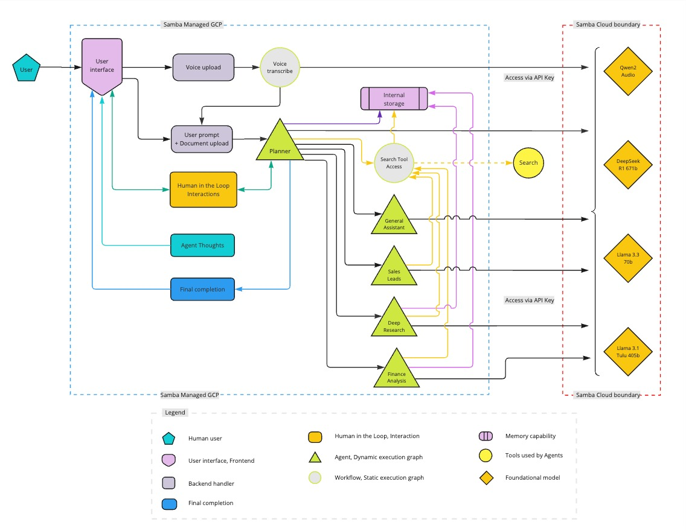

<h1 style="font-size: 3em;">Agents</h1>

The Agents application is an advanced multi-agent AI system that intelligently routes requests to specialized agents and subgraphs for comprehensive assistance. The system features a compound agent architecture with XML-based routing, code execution capabilities, and multi-step research workflows. The Agents application helps users by:

- Providing intelligent assistance through a unified compound agent system.
- Executing code in secure Daytona sandbox environments.
- Performing comprehensive data science workflows with multi-agent collaboration.
- Generating detailed research reports and educational content.
- Conducting advanced financial analysis with real-time data.
- Automatically routing queries to appropriate specialized subgraphs.
- Supporting voice input for natural interaction.

The basic process of the Agents application is described below.

1. **Enhanced agent processing**
   - User submits a query via text or voice input.
   - The compound agent system uses XML-based routing to determine the best approach.
   - Queries are processed through the main agent or routed to specialized subgraphs.

1. **Intelligent subgraph routing**
   - The system automatically determines if queries require specialized subgraph processing.
   - Available subgraphs include: Financial Analysis, Deep Research, Data Science, and Code Execution.
   - Multi-agent collaboration within subgraphs for complex workflows.
   
1. **Tool and data integration**
   - Dynamic tool loading based on user context and permissions.
   - Integration with external APIs, databases, and knowledge sources.
   - Secure code execution and file generation in Daytona sandbox.
   
1. **Real-time response generation**
   - WebSocket-based streaming for real-time updates and agent reasoning.
   - Structured responses with metadata for appropriate UI rendering.
   - File artifacts (PDF, HTML, images, CSV) automatically processed and displayed.

1. **Adaptive user interaction**
   - Frontend intelligence automatically detects agent behaviors and adapts UI.
   - Agent reasoning panel shows real-time thought processes.
   - Continuous learning from interactions to improve future responses.

- **API Access**
   - The application provides a REST API for programmatic access to its features such as deep research and data science workflows.

> **Note**: View the **Agent Reasoning** panel on the right side of the application to see the real-time thought output. The **Daytona Sidebar** automatically opens when code execution is detected. 

# Prerequisites

Ensure to install the prerequisites.
   - [Python 3.11](https://www.python.org/downloads/release/python-31111/) (exact version required)
   - [Node.js 18.17.0 or later](https://nodejs.org/en/download)
   - [Yarn](https://classic.yarnpkg.com/en/docs/install)
   - [Redis](https://redis.io/download) (via Docker or Homebrew)
     
      ```bash
      # Run Redis with Docker
      docker run -p 6379:6379 redis/redis-stack:latest
      ```
      ```bash
      # Install Redis with Homebrew on macOS
      brew install redis
      brew services start redis
      ```

Get the following API keys to setup the Agents application.
   - [SambaNova API key](https://cloud.sambanova.ai/) (required)
   - [Serper API key](https://serper.dev/) for web search (required)
   - [Exa API key](https://exa.co/) for company data (required)
   - [Tavily API key](https://tavily.com/) for deep research capabilities (required)
   - [Daytona API key](https://www.daytona.io/) for secure code execution sandbox (required)
   - [Clerk](https://clerk.com/) for authentication (you'll need both publishable and secret keys)
   - [LangSmith API key](https://langsmith.com/) for optional usage tracking and monitoring (optional)

>**Note**: The system supports multiple LLM providers including SambaNova's DeepSeek V3, Llama 3.3 70B, Llama Maverick, and DeepSeek R1 models.

# Setup and run the application

You can setup and run the application in two ways: Cloud hosted version or locally hosted version.

## Cloud hosted version

This version is hosted on SambaNova Cloud. No need to install dependencies locally.

1. Go to the [Agents application](https://aiskagents.cloud.snova.ai/) login page.
1. Sign in using Clerk authentication (you will receive an email with login instructions).
1. Once you login, go to settings and add the API keys.
1. Start using the application to enhance workflows, conduct research, execute code, and gain actionable insights.

## Locally hosted version

### Frontend setup

Follow the steps below to install the frontend for the Agents application.

> **Note**: For the following commands, go to `/frontend/sales-agent-crew/` directory.

1. Install Vue.js dependencies.

   ```bash
   yarn install
   ```

1. Run a local development environment.

   ```bash
   yarn dev
   ```

1. Create a production build.

   ```bash
   yarn build
   ```

### Backend setup

Follow the steps below to install the backend for the Agents application.

> **Note**: For the following commands, go to `/backend/` directory.

1. Install Python dependencies: Create and activate a virtual environment (for example with venv) and install the project dependencies inside it. Make sure to use Python 3.11.

   ```bash
   # Install uv first
   pip install uv

   cd backend
   uv sync
   uv pip install -e .
   # activate the virtual environment
   source .venv/bin/activate
   ```

1. Run the application.

   ```bash
   uvicorn agents.api.main:app --reload --host 127.0.0.1 --port 8000
   ```

### Environment variables setup

#### Frontend environment variables

> **Note**: For the frontend environment variables, go to `/frontend/sales-agent-crew/`.

1. Create a `.env` file with the following variables.
   ```bash
   VITE_API_URL=/api
   VITE_WEBSOCKET_URL=ws://localhost:8000
   VITE_AUTH0_DOMAIN=your_auth0_domain
   VITE_AUTH0_CLIENT_ID=your_auth0_client_id
   VITE_AUTH0_AUDIENCE=your_auth0_audience
   ```

#### Backend environment variables

> **Note**: For the backend environment variables, go to `/backend/`.

1. Create a `.env` file with the following required variables.
   ```bash
   # Authentication
   AUTH0_DOMAIN=your-auth0-domain.auth0.com
   AUTH0_AUDIENCE=your-auth0-api-audience
   
   # Core API Keys (can be user-provided or environment-based)
   SERPER_KEY=your_serper_api_key
   EXA_KEY=your_exa_api_key
   
   # Research and Deep Analysis
   TAVILY_API_KEY=your_tavily_api_key  # Required for Deep Research subgraph
   TAVILY_API_KEY_1=your_second_tavily_key  # Optional: Additional keys for rotation
   TAVILY_API_KEY_2=your_third_tavily_key   # Optional: Additional keys for rotation
   
   # Code Execution
   DAYTONA_API_KEY=your_daytona_api_key  # Required for secure code execution sandbox
   
   # System Configuration
   ENABLE_USER_KEYS=true  # Set to "false" to use only environment API keys
   REDIS_MASTER_SALT=your_redis_encryption_salt  # For encrypting user data
   
   # Optional: Tracking and Monitoring
   LANGSMITH_API_KEY=your_langsmith_api_key  # Optional for usage tracking and monitoring
   
   # Optional: MLflow Integration
   MLFLOW_TRACKING_ENABLED=false  # Set to "true" to enable MLflow tracking
   MLFLOW_TRACKING_URI=your_mlflow_uri  # Required if MLflow is enabled
   
   # Optional: Usage tracking
   LANGTRACE_API_KEY=your_langtrace_api_key  # Optional for usage tracking
   ```

1. Start the FastAPI backend server.

   ```bash
   # From the project root
   cd backend
   uvicorn api.main:app --reload
   ```

1. Start the Vue.js frontend development server.

   ```bash
   # From the project root
   cd frontend/sales-agent-crew/
   yarn dev
   ```

1. Open your browser and navigate to:

   ```bash
   http://localhost:5174/
   ```

### API keys setup

You can access the settings modal to configure the API keys mentioned in the [prerequisites](#prerequisites) section. The system supports both user-provided API keys and environment-based configuration.

### Clerk authentication setup

1. Sign up for a Clerk account at [clerk.com](https://clerk.com/).
1. Create a new application in the Clerk dashboard.
1. Get your publishable key and secret key.
1. Configure your JWT issuer URL.
1. Add these values to your environment variables as shown above.

### (Optional) LangTrace integration

If you want to track usage and monitor the application's performance:

1. Sign up for a LangTrace account
1. Add your LangTrace API key to the backend `.env` file
1. The application will automatically log traces (disabled by default)

# Architecture



The system is built on a compound agent architecture with intelligent routing and specialized subgraphs:

## Core Agent System
- **EnhancedConfigurableAgent**: Main orchestrator with XML-based routing
- **XML Agent Executor**: Decision-making engine that routes between tools and subgraphs
- **Dynamic Tool Loading**: User-specific and static tools with caching
- **WebSocket Streaming**: Real-time execution updates and agent reasoning

## Specialized Subgraphs
- **Financial Analysis**: Comprehensive financial reporting with crew-based analysis
- **Deep Research**: Multi-step research workflows with user feedback
- **Data Science**: End-to-end data science workflows with multiple specialized agents
- **Code Execution**: Secure Daytona sandbox for code execution and file generation

This application is built with:

- Vue 3 + Composition API with intelligent UI adaptation
- Vite
- TailwindCSS
- Clerk for authentication
- LangGraph for agent workflows
- FastAPI backend with Redis caching
- WebSocket for real-time communication

# Technology stack

The stack is designed to offer high-performance and scalability for both frontend and backend needs. See the frontend and backend technology stack listed in the table below.

<table style="width:40%; border: 1px solid #000; border-collapse: collapse;">
  <thead>
      <tr style="background-color: #f0f0f0;"> <!-- Shading applied here -->
      <th style="border: 1px solid #000; width: 30%; text-align: left; vertical-align: top;">Category</th>
      <th style="border: 1px solid #000; width: 80%; text-align: left; vertical-align: top;">Technologies used</th>
    </tr>
  </thead>
  <tbody>
    <tr>
      <td style="border: 1px solid #000; width: 30%; text-align: left; vertical-align: top;"><strong>Frontend</strong></td>
      <td style="border: 1px solid #000; width: 80%; text-align: left; vertical-align: top;">
        <ul>
          <li>Vue.js 3 (Composition API)</li>
          <li>TailwindCSS for styling</li>
          <li>Vite for build tooling</li>
          <li>Clerk for authentication</li>
          <li>WebSocket for real-time communication</li>
          <li>Intelligent UI with automatic sidebar management</li>
        </ul>
      </td>
    </tr>
    <tr>
      <td style="border: 1px solid #000; width: 30%; text-align: left; vertical-align: top;"><strong>Backend</strong></td>
      <td style="border: 1px solid #000; width: 80%; text-align: left; vertical-align: top;">
        <ul>
          <li>FastAPI with WebSocket support</li>
          <li>LangGraph for agent workflows</li>
          <li>CrewAI for multi-agent systems</li>
          <li>SambaNova Agentic Cloud (DeepSeek V3, Llama models)</li>
          <li>Daytona SDK for secure code execution</li>
          <li>Redis for caching and session management</li>
          <li>Tavily API for research capabilities</li>
          <li>Exa Search API for company intelligence</li>
        </ul>
      </td>
    </tr>
  </tbody>
</table>


# Features

This section describes the agents and feature capabilities of the application. 

## Enhanced compound agent system

The core agent system provides:

- **Intelligent routing**: XML-based decision making for optimal tool and subgraph selection.
- **Multi-LLM support**: SambaNova (DeepSeek V3, Llama 3.3 70B, Llama Maverick), and other Models powered by SambaNova.
- **Dynamic tool loading**: User-specific tools with 5-minute caching and graceful fallbacks.
- **Real-time streaming**: WebSocket-based execution updates with agent reasoning.
- **Secure execution**: All code execution happens in isolated Daytona sandbox environments.

## General assistant

The General assistant agent helps with:

- Answering basic questions and queries.
- Providing explanations and clarifications.
- Offering technical support.
- Assisting with general research tasks.
- Quick factual information about companies, products, and current events.

### Example queries

Example queries for general assistance are listed below.

- "What's the difference between supervised and unsupervised learning?"
- "Can you explain how REST APIs work?"
- "What are the best practices for data visualization?"
- "How do I optimize database queries?"
- "What is Tesla's current stock price?"
- "What's the latest news on Apple?"

## Code execution and data science

The application uses the **Daytona Code Sandbox** and **Data Science Subgraph** for:

- **Secure code execution**: Python code runs in isolated Daytona sandbox environments.
- **File generation**: Automatic creation and display of PDFs, HTML, images, CSV files.
- **Data science workflows**: Multi-agent collaboration for complex data analysis projects.
- **Machine learning**: Model development, predictive analytics, statistical modeling.
- **Data visualization**: Automatic chart and graph generation.
- **Hypothesis testing**: Scientific approach to data analysis with validation.

### Example queries

Example queries for code execution and data science are listed below.

- "Create a machine learning model to predict customer churn using this dataset"
- "Generate a Python script to analyze sales trends and create visualizations"
- "Build a statistical model to analyze the relationship between variables"
- "Create a data cleaning pipeline for this CSV file"
- "Develop a predictive analytics dashboard with interactive charts"
- "Perform hypothesis testing on this experimental data"


### Example queries


## Deep research

For research queries, the application uses the **Deep Research Subgraph** to:

- Generate comprehensive multi-perspective research reports.
- Create structured educational content with citations.
- Conduct multi-step research workflows with user feedback.
- Provide in-depth analysis on complex topics.
- Include relevant sources and academic references.

### Example queries

Example queries for research and content generation are listed below.

- "Generate a comprehensive report on quantum computing applications in cryptography"
- "Create an in-depth analysis of CRISPR gene editing in modern medicine"
- "Research the relationship between AI and neuromorphic computing with sources"
- "Provide a thorough investigation of blockchain's impact on supply chain management"
- "Analyze the latest developments in fusion energy research with academic citations"
- "Create a detailed market research report on the EV industry trends"

## Financial analysis

For financial queries, the application uses the **Financial Analysis Subgraph** to:

- Analyze company financial performance with comprehensive reporting.
- Track market trends and competitive positioning.
- Evaluate stock performance and valuation metrics.
- Generate investment insights and risk assessments.
- Monitor industry-specific metrics and comparisons.
- Provide real-time financial data and analysis.

### Example queries

Example queries for financial analysis and market research are listed below.

- "Provide a comprehensive financial analysis of Tesla including competitors and risk assessment"
- "Analyze the semiconductor industry performance this quarter with market trends"
- "Compare cloud revenue growth between Microsoft Azure and AWS with technical analysis"
- "Evaluate Apple's financial health considering recent product launches and market position"
- "Create a detailed investment report on major EV manufacturers with risk analysis"
- "Analyze the fintech industry trends and top performers with financial metrics"

## Intelligent system features

The application includes several intelligent automation features:

### Automatic UI adaptation
- **Daytona sidebar**: Automatically opens when code execution is detected
- **Agent type detection**: Routes responses to appropriate UI components
- **File artifact handling**: Inline preview for images, PDFs, HTML, CSV files
- **Real-time updates**: Live execution logs and status tracking

### Advanced routing
- **XML-based decisions**: Sophisticated routing between tools and subgraphs
- **Context awareness**: System understands query intent and complexity
- **Subgraph selection**: Automatic determination of best workflow for the task
- **Tool orchestration**: Dynamic loading and execution of appropriate tools

## Voice input support

The application allows you to make queries using audio input. Simply click the microphone icon to start speaking. It also offers:

- Automatic speech-to-text transcription
- Hands-free operation for convenience

## Additional features

Additional features of the application are listed below.

- 🔐 **Secure API key management** – Encrypted storage with user-specific keys
- 📜 **Chat history tracking** – Persistent conversation storage with Redis
- 📥 **Results export functionality** – Download generated files and reports
- 🔄 **Real-time agent reasoning** – Live thought process display
- 🛡️ **Secure code execution** – Isolated Daytona sandbox environments  
- 📊 **Multi-format file support** – PDF, HTML, CSV, images with inline preview
- 💹 **Real-time financial data** – Live market data and analysis
- 🤖 **Multi-agent collaboration** – Specialized agents working together
- ⚡ **WebSocket streaming** – Real-time updates and responsive UI

# Usage

1. **Configure API keys**

   - Open settings
   - Enter your API keys (SambaNova, Serper, Exa, Tavily, Daytona)
   - Keys are securely encrypted and stored per user

1. **Start using the system**

   - Type your query or use voice input
   - System automatically determines the best approach (main agent vs. specialized subgraphs)
   - Watch real-time agent reasoning in the sidebar

1. **Code execution and data science**
   - Upload datasets or ask for code generation
   - Daytona sidebar automatically opens for code execution
   - Generated files (PDFs, charts, data) appear with inline preview

1. **View and export results**
   - Research reports displayed as structured documents
   - Financial analysis shown with charts and metrics
   - Export functionality available for all generated content
   - Save important conversations and artifacts

# Contributing

1. Fork the repository
1. Create your feature branch
1. Commit your changes
1. Push to the branch
1. Create a new pull request

# License

[MIT License](LICENSE)


